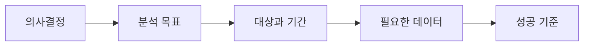

<Callout type="info">
  **이번 문서의 목표:** 막연한 “데이터를 분석하자”를, 실제로 답할 수 있는 분석 질문으로 바꿉니다.
</Callout>

## “회원이 줄었어요”만으로는 분석을 시작할 수 없다

음악 앱의 담당자가 이렇게 말합니다.

> “이번 달 유료 회원이 줄었어요. 데이터를 분석해 주세요.”

문제는 이 말만으로는 무엇을 찾아야 하는지 정할 수 없다는 점입니다. 회원 수가 줄었다는 것은 **현상**이고, 분석 과제는 그 현상을 바꾸기 위해 내려야 할 **결정**에서 시작합니다.

예를 들어 담당자가 내릴 결정은 “해지 가능성이 높은 회원에게 어떤 혜택을 먼저 보여 줄까?”일 수 있습니다. 이 결정에 맞춰 질문을 바꾸면 다음처럼 구체적이 됩니다.

| 구분 | 막연한 요청 | 분석 과제 |
| --- | --- | --- |
| 목표 | 회원이 줄었다 | 다음 달 해지율을 낮춘다 |
| 질문 | 왜 줄었을까? | 해지 전 30일 동안 어떤 이용 패턴이 공통으로 나타나는가? |
| 대상 | 전체 회원 | 최근 90일 안에 결제한 유료 회원 |
| 결과물 | 분석 보고서 | 해지 위험 회원 목록과 우선 대응 기준 |

## 분석 과제는 네 가지를 정한다

**분석 과제**는 데이터를 써서 해결할 질문을 명확하게 적은 문장입니다. 아래 네 가지가 빠지면 결과를 봐도 행동으로 옮기기 어렵습니다.

1. **의사결정**: 분석 결과를 보고 누가 무엇을 바꿀까?
2. **분석 목표**: 줄이고 싶은 것, 늘리고 싶은 것은 무엇일까?
3. **대상과 기간**: 어떤 사람·서비스·기간을 볼까?
4. **성공 기준**: 결과가 좋아졌다고 판단할 숫자는 무엇일까?

여기서 **성공 기준**은 KPI(Key Performance Indicator), 즉 목표 달성 여부를 확인하는 핵심 숫자입니다. 이 사례에서는 “다음 달 해지율”이 KPI가 될 수 있습니다.

## 좋은 질문은 데이터로 확인할 수 있다

다음 두 문장을 비교해 봅시다.

| 문장 | 판단 | 이유 |
| --- | --- | --- |
| 이용자를 더 만족하게 하려면 어떻게 해야 할까? | 아직 너무 넓음 | 대상, 기간, 측정 방법이 없다 |
| 최근 30일 재생 횟수가 3회 미만인 유료 회원의 다음 달 해지율은 다른 회원보다 높은가? | 분석 가능 | 비교 대상과 기준, 확인할 결과가 있다 |

두 번째 질문은 회원별 `최근 30일 재생 횟수`, `다음 달 해지 여부` 데이터를 모아 확인할 수 있습니다. 분석 모델은 그다음 단계다. 먼저 질문이 선명해야 어떤 데이터를 모으고 어떤 방법을 선택할지도 정할 수 있습니다.

<Callout type="warning">
  “AI 모델을 만들자”는 분석 목표가 아닙니다. 모델은 질문에 답하기 위한 도구이고, 먼저 바꿀 의사결정과 성공 기준을 정해야 합니다.
</Callout>

## 과제 문장을 직접 만들어 보기

처음에는 아래 틀에 채워 넣으면 충분합니다.

<Callout type="important">
  <strong>[대상]</strong>의 <strong>[문제 또는 기회]</strong>를 줄이거나 늘리기 위해, <strong>[기간]</strong>의 <strong>[데이터]</strong>를 분석하여 <strong>[의사결정]</strong>에 활용한다. 성공은 <strong>[KPI]</strong>로 확인한다.
</Callout>

음악 앱 사례에 적용하면 이렇게 됩니다.

> 최근 90일 안에 결제한 유료 회원의 해지를 줄이기 위해, 최근 30일 이용 기록과 결제 이력을 분석하여 혜택 제공 대상을 정한다. 성공은 다음 달 해지율 감소로 확인한다.

이 문장이 완벽할 필요는 없습니다. 다만 분석을 시작하기 전 팀이 같은 문제를 보고 있는지 확인하는 기준이 됩니다.

## 핵심 정리

- 데이터 분석은 “데이터가 많아서”가 아니라, 더 나은 의사결정을 해야 해서 시작합니다.
- 분석 과제에는 목표, 대상·기간, 필요한 데이터, 성공 기준이 필요합니다.
- KPI는 목표가 달성됐는지 확인하는 핵심 숫자입니다.
- 모델 선택보다 먼저, 데이터로 확인 가능한 질문을 만드는 일이 중요합니다.

## 마무리 복습

<Quiz
  questionNumber={1}
  question="다음 중 분석 과제를 가장 잘 정의한 문장은 무엇인가요?"
  options={[
    '데이터를 최대한 많이 모아 AI 모델을 만든다.',
    '서비스를 더 좋게 만들 방법을 찾는다.',
    '최근 30일 구매 이력이 없는 회원의 재구매율을 높이기 위해 이탈 요인을 분석하고, 다음 달 재구매율로 효과를 확인한다.',
    '분석 결과를 보기 좋게 시각화한다.',
  ]}
  correctAnswer={3}
  explanation="대상, 목표, 분석 방향, 성공 기준이 모두 들어 있어 실제 분석 작업으로 이어질 수 있습니다."
  optionExplanations={[
    'AI 모델은 도구일 뿐, 해결하려는 문제와 성공 기준이 없습니다.',
    '방향은 좋지만 대상과 측정 기준이 너무 넓습니다.',
    '맞습니다. 분석 과제에 필요한 요소가 구체적으로 정리돼 있습니다.',
    '시각화는 결과를 전달하는 방법이며 분석 목표 자체는 아닙니다.',
  ]}
/>

<Quiz
  questionNumber={2}
  question="KPI에 대한 설명으로 가장 알맞은 것은 무엇인가요?"
  options={[
    '데이터를 저장하는 서버 이름',
    '목표 달성 여부를 확인하는 핵심 숫자',
    '분석에 사용하는 인공지능 알고리즘',
    '표본에서 제외해야 하는 이상한 값',
  ]}
  correctAnswer={2}
  explanation="KPI는 목표와 연결된 핵심 성과 지표입니다. 예를 들어 해지율 감소, 구매 전환율 증가가 될 수 있습니다."
  optionExplanations={[
    '서버나 도구 이름은 KPI가 아닙니다.',
    '맞습니다. 목표가 실제로 좋아졌는지 숫자로 확인하는 기준입니다.',
    '알고리즘은 분석 방법이고 KPI는 성과 측정 기준입니다.',
    '이상치는 데이터 정제 단계에서 다루는 값입니다.',
  ]}
/>

<Quiz
  questionNumber={3}
  question="분석을 시작할 때 가장 먼저 확인할 질문은 무엇인가요?"
  options={[
    '가장 복잡한 모델은 무엇인가?',
    '분석 결과를 보고 어떤 의사결정을 바꿀 것인가?',
    '그래프 색상은 무엇으로 할까?',
    '데이터 파일 이름은 무엇인가?',
  ]}
  correctAnswer={2}
  explanation="분석은 의사결정을 돕기 위한 일입니다. 의사결정이 정해져야 목표·데이터·성공 기준도 정할 수 있습니다."
  optionExplanations={[
    '모델 선택은 질문과 데이터가 정해진 뒤에 합니다.',
    '맞습니다. 분석의 출발점은 바꾸려는 의사결정입니다.',
    '표현 방식은 결과를 만든 뒤에 정합니다.',
    '파일 이름은 작업 관리 정보일 뿐 분석 목적은 아닙니다.',
  ]}
/>

## 참고 자료

- [KDATA 데이터자격시험 - 빅데이터분석기사](https://www.dataq.or.kr/www/sub/a_07.do)
- [NIST/SEMATECH e-Handbook of Statistical Methods](https://www.itl.nist.gov/div898/handbook/)