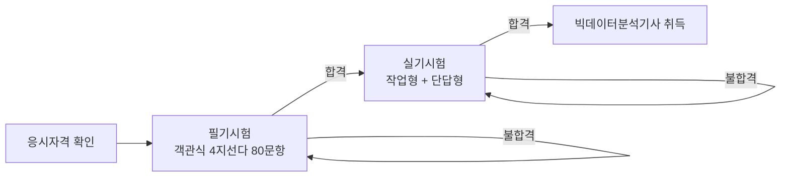
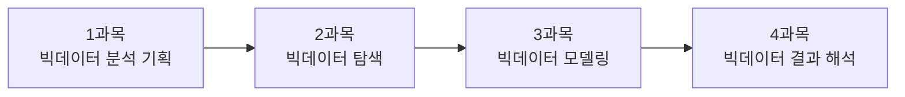
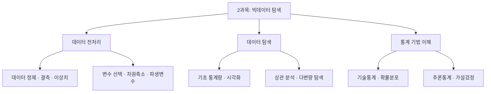

<Callout type="info">
  **이번 문서의 목표:** 빅데이터분석기사 필기의 과목 구성·문항 수·시간·합격 규칙을 정확히 외우고, "몇 문제를 어느 과목에서 맞혀야 합격인가"를 직접 계산해 자기 목표 점수를 세울 수 있게 된다.
</Callout>

## 왜 시험 구조부터 배우는가

공부를 시작할 때 대부분은 곧장 1과목 첫 페이지를 펼칩니다. 그런데 이 시험은 **총점만 높으면 붙는 시험이 아닙니다.** 한 과목이라도 기준 미달이면 나머지를 아무리 잘 봐도 떨어집니다. 이 규칙을 모르고 공부하면, 재미있는 과목(주로 통계·모델링)만 파고들다가 가장 지루한 1과목에서 과락으로 탈락하는 전형적인 실패를 겪습니다.

> **쉽게 말하면:** 이 시험은 "평균 점수 경쟁"이 아니라 "**모든 과목에서 최소선을 넘고, 동시에 평균선도 넘는**" 두 개의 관문을 통과하는 시험입니다.

그래서 첫 편은 개념이 아니라 **규칙**을 다룹니다. 규칙을 알면 이후 26편을 읽는 동안 "이 편은 몇 문제짜리인가"를 계속 가늠할 수 있습니다.

## 1. 자격 전체 구조 — 필기와 실기

빅데이터분석기사는 한국데이터산업진흥원(K-DATA, Korea Data Agency)이 시행하는 국가기술자격입니다. 자격 취득은 두 단계로 나뉩니다.

- **필기**(筆記): 객관식 4지선다(사지선다) 시험입니다. 개념·용어·절차를 알고 있는지, 간단한 통계량과 평가지표를 계산할 수 있는지를 묻습니다. **이 문서 시리즈가 다루는 범위**입니다.
- **실기**(實技): 파이썬(Python) 또는 R로 실제 데이터를 처리하는 작업형 시험입니다. 이 시리즈에서는 다루지 않습니다.

필기에 합격하면 일정 기간 동안 실기에 응시할 수 있는 자격이 유지됩니다. 즉 **필기는 실기로 가는 관문**이며, 필기 개념은 실기의 코드가 "무엇을 하는 코드인지" 이해하는 바탕이 되기도 합니다.

## 2. 필기 4과목 구성 — 각 과목이 무엇을 묻는가

필기는 네 과목으로 나뉘고, **과목마다 정확히 20문항**씩 출제됩니다. 과목 이름만 외우면 시험장에서 아무 도움이 되지 않으므로, 각 과목이 분석 프로젝트의 어느 단계에 해당하는지를 함께 잡아 둡니다.

이 순서는 실제 데이터 분석 프로젝트가 흘러가는 순서와 같습니다. **무엇을 왜 분석할지 정하고(1과목) → 데이터를 살펴 다듬고(2과목) → 모형을 만들고(3과목) → 성능을 평가해 현업에 쓰는(4과목)** 흐름입니다.

| 과목 | 주요 항목 | 문항 수 | 성격 |
|------|-----------|---------|------|
| 1과목 빅데이터 분석 기획 | 빅데이터의 이해 / 데이터 분석 계획 / 데이터 수집 및 저장 계획 | 20 | 용어·제도 암기 비중이 큼 |
| 2과목 빅데이터 탐색 | 데이터 전처리 / 데이터 탐색 / 통계 기법 이해 | 20 | 개념 이해 + 계산 |
| 3과목 빅데이터 모델링 | 분석모형 설계 / 분석기법 적용 | 20 | 알고리즘 원리 이해 |
| 4과목 빅데이터 결과 해석 | 분석모형 평가 및 개선 / 분석결과 해석 및 활용 | 20 | 평가지표 계산 + 해석 |
| **합계** | – | **80** | – |

### 과목별로 문제가 어떻게 다른가

같은 "80문항"이라도 과목마다 요구하는 능력이 다릅니다. 이 차이를 모르면 공부 방식을 잘못 고릅니다.

- **1과목은 암기형이 많습니다.** 예를 들어 "가명정보와 익명정보 중 개인정보에 해당하는 것은?" 같은 문제는 이해로 풀리지 않고 **정의를 정확히 외웠는지**로 갈립니다.
- **2·3·4과목은 이해형이 많습니다.** "평균이 중앙값보다 크다면 무엇을 의심할 수 있는가" 같은 문제는 외운 문장을 그대로 되풀이하는 것이 아니라 **개념을 새 상황에 적용**해야 합니다.

이 시험의 가장 큰 특징은 **덤프(dump, 기출 문제 통째 암기)가 잘 통하지 않는다**는 점입니다. 실제 기출은 같은 개념을 매 회차 다른 상황으로 감싸서 냅니다. 예컨대 "품질 기록률 97퍼센트, 승인 기준 98퍼센트 이상"이라는 상황을 주고 **어떤 품질 차원인지 + 승인할지 보류할지**를 동시에 묻는 식입니다. 문장을 외운 사람은 못 풀고, 완전성(completeness)이 무엇인지 이해한 사람은 풉니다.

## 3. 시험 형식 — 80문항, 120분

| 항목 | 내용 |
|------|------|
| 검정 방법 | 객관식 4지선다 |
| 문항 수 | 총 80문항 (과목당 20문항) |
| 시험 시간 | 120분 |
| 과목당 배점 | 100점 만점 (문항당 5점) |
| 문항당 평균 시간 | 90초 |

### 문항당 90초가 무슨 뜻인지 계산해 보자

시간 배분은 감으로 잡으면 안 되고 숫자로 잡아야 합니다.

$$
\text{문항당 평균 시간} = \frac{120\ \text{분} \times 60\ \text{초}}{80\ \text{문항}} = \frac{7200}{80} = 90\ \text{초}
$$

- 분자 $120 \times 60$: 전체 시험 시간을 초로 바꾼 값
- 분모 $80$: 총 문항 수
- 결과 $90$: 한 문항에 쓸 수 있는 평균 시간(초)

**해석:** 90초는 넉넉해 보이지만, 여기에는 마킹(답안 표기)과 검토 시간이 포함되어 있지 않습니다. 검토·마킹에 15분을 남기려면 실제 풀이 시간은 105분이고, 이때 문항당 시간은 다음과 같습니다.

$$
\frac{105 \times 60}{80} = \frac{6300}{80} = 78.75\ \text{초}
$$

즉 **한 문항을 약 79초 안에 끝내야** 검토 시간이 남습니다. 개념 문제는 20~30초에 끊고, 그렇게 아낀 시간을 계산 문제에 몰아주는 전략이 여기서 나옵니다(자세한 전략은 06편).

## 4. 합격 기준 — 두 개의 관문

이 시험의 합격 규칙은 두 조건을 **동시에** 만족해야 합니다.

<Steps>

1. **과목별 조건(과락 방지):** 네 과목 각각에서 **40점 이상**. 100점 만점에 40점이므로 20문항 중 **8문항 이상**입니다.
2. **전체 조건(평균):** 네 과목 **평균 60점 이상**. 총점으로 환산하면 400점 만점에 **240점 이상**, 문항으로는 80문항 중 **48문항 이상**입니다.

</Steps>

> **쉽게 말하면:** "**모든 과목에서 8문제 이상**을 맞히면서, **전체로는 48문제 이상**을 맞혀야 한다"는 뜻입니다.

### 평균 60점을 문항 수로 바꾸는 계산

시험장에서 헷갈리지 않게, 점수와 문항 수의 환산을 직접 해 둡니다.

$$
\text{과목 점수} = (\text{맞힌 문항 수}) \times 5
$$

- 곱하는 수 $5$: 과목당 100점을 20문항으로 나눈 문항당 배점 $100 \div 20 = 5$

따라서 40점은 $40 \div 5 = 8$문항, 60점은 $60 \div 5 = 12$문항입니다. 평균 60점은 네 과목 합계로 보면 다음과 같습니다.

$$
\text{필요 총점} = 60 \times 4 = 240\ \text{점}
$$

$$
\text{필요 총 문항} = \frac{240}{5} = 48\ \text{문항}
$$

- $60$: 요구되는 과목 평균 점수
- $4$: 과목 수
- $5$: 문항당 배점

### 합격·불합격이 갈리는 세 가지 상황

기출에서 합격 기준은 "다음 중 합격인 사람은?" 형태로 **사례 판단형**으로 나옵니다. 세 가지 대표 상황을 직접 판정해 봅시다.

| 상황 | 1과목 | 2과목 | 3과목 | 4과목 | 평균 | 판정 |
|------|-------|-------|-------|-------|------|------|
| A | 35 | 80 | 85 | 80 | 70 | **불합격** (1과목 40점 미만) |
| B | 60 | 60 | 55 | 65 | 60 | **합격** (모두 40점 이상, 평균 60점) |
| C | 45 | 55 | 55 | 60 | 53.75 | **불합격** (평균 60점 미만) |

**상황 A의 계산과 해석:** 평균은 $(35+80+85+80) \div 4 = 280 \div 4 = 70$점으로 기준을 크게 넘습니다. 하지만 1과목이 40점 미만이므로 **과락**입니다. 이 사람은 총점 기준으로는 상위권인데도 떨어집니다. **가장 지루한 과목을 버리면 안 되는 이유**가 바로 이 사례에 있습니다.

**상황 C의 계산과 해석:** 모든 과목이 40점 이상이라 과락은 없습니다. 평균은 $(45+55+55+60) \div 4 = 215 \div 4 = 53.75$점으로 60점에 미달합니다. 과락만 피하는 전략으로는 붙을 수 없다는 뜻입니다.

### 자주 틀리는 점

- **"평균 60점이면 과락은 상관없다"는 오해** — 두 조건은 AND(그리고) 관계입니다. 하나라도 어기면 불합격입니다.
- **"과목당 40점만 넘으면 된다"는 오해** — 네 과목 모두 40점이면 평균이 40점이라 불합격입니다.
- **점수와 문항 수 혼동** — 40점은 40문항이 아니라 8문항입니다. 배점이 5점이라는 사실을 반드시 함께 기억합니다.

## 5. 현실적인 목표 점수 설계

합격 기준을 알았으니, "어느 과목에서 몇 개를 맞힐 것인가"를 미리 정해 둡니다. 시험장에서 즉흥적으로 판단하면 시간을 잃습니다.

| 전략 | 1과목 | 2과목 | 3과목 | 4과목 | 총 문항 | 총점 | 판정 |
|------|-------|-------|-------|-------|---------|------|------|
| 안전형 | 13 | 14 | 13 | 14 | 54 | 270 | 합격(여유 6문항) |
| 최소형 | 12 | 12 | 12 | 12 | 48 | 240 | 합격(여유 0문항) |
| 위험형 | 8 | 15 | 15 | 12 | 50 | 250 | 합격이지만 1과목이 위태로움 |

**해석:** 최소형은 한 문항만 틀려도 바로 떨어지므로 목표로 삼기에 위험합니다. 실제 준비에서는 **과목당 13~15문항(65~75점)** 을 목표로 잡는 안전형이 표준입니다. 위험형처럼 1과목을 8문항에 맞춰 두면, 시험장에서 애매한 문제가 두 개만 나와도 곧바로 과락 위험권에 들어갑니다.

> **쉽게 말하면:** 목표는 "만점"이 아니라 "**모든 과목에서 13개 이상**"입니다. 잘하는 과목을 90점으로 올리는 것보다, 못하는 과목을 40점에서 60점으로 올리는 것이 합격에 훨씬 크게 기여합니다.

## 6. 출제기준을 읽는 법

공식 출제기준은 **과목 → 주요 항목 → 세부 항목**의 3단 구조로 되어 있습니다. 예를 들어 2과목은 다음처럼 펼쳐집니다.

이 구조를 알아 두면 두 가지 이득이 있습니다. 첫째, **모르는 문제를 만났을 때 그것이 어느 세부 항목인지 즉시 분류**할 수 있어 오답 노트를 항목별로 쌓을 수 있습니다. 둘째, 출제기준에 없는 내용(예: 최신 딥러닝 실무, 특정 클라우드 제품 사용법)에 시간을 쓰지 않게 됩니다.

## 핵심 정리

- 필기는 **4과목 × 20문항 = 총 80문항**, **120분**, 객관식 4지선다이며 문항당 배점은 **5점**이다.
- 합격은 **과목당 40점(8문항) 이상**과 **평균 60점(총 48문항) 이상**을 **동시에** 만족해야 한다. 하나라도 어기면 불합격이다.
- 과목 순서(기획 → 탐색 → 모델링 → 결과 해석)는 실제 분석 프로젝트의 흐름과 같아, 편들이 서로 이어진다.
- 1과목은 암기 비중이 크고 2·3·4과목은 이해·계산 비중이 크다. **덤프 암기로는 통하지 않는 응용·사례 판단형**이 많다.
- 현실적 목표는 만점이 아니라 **모든 과목 13문항 이상**이다. 약한 과목을 끌어올리는 것이 합격에 가장 효율적이다.

## 마무리 복습

<Quiz
  questionNumber={1}
  question="빅데이터분석기사 필기시험의 구성으로 옳은 것은?"
  options={['3과목 60문항 90분', '4과목 80문항 120분', '4과목 100문항 150분', '5과목 80문항 120분']}
  correctAnswer={2}
  explanation="필기는 빅데이터 분석 기획, 빅데이터 탐색, 빅데이터 모델링, 빅데이터 결과 해석의 4과목으로 구성되며 과목당 20문항씩 총 80문항을 120분 동안 푼다. 과목 수와 문항 수, 시간을 한 세트로 기억해야 문항당 90초라는 시간 배분 계산이 가능하다."
  optionExplanations={['과목 수와 문항 수, 시험 시간이 모두 다르다. 3과목 체제는 존재하지 않는다.', '4과목 각 20문항씩 총 80문항을 120분에 푸는 구성이 맞다.', '문항 수 100문항과 시험 시간 150분은 실제 구성과 다르다.', '과목은 4과목이며 5과목 체제가 아니다. 문항 수와 시간만 맞고 과목 수가 틀렸다.']}
/>

<Quiz
  questionNumber={2}
  question="네 과목 점수가 1과목 35점, 2과목 80점, 3과목 85점, 4과목 80점인 수험생의 합격 여부와 근거로 옳은 것은?"
  options={['평균이 70점이므로 합격이다', '1과목이 40점 미만이므로 과락으로 불합격이다', '평균이 60점 미만이므로 불합격이다', '총점이 240점 미만이므로 불합격이다']}
  correctAnswer={2}
  explanation="평균은 (35+80+85+80)÷4=70점으로 평균 조건은 충족하지만, 1과목이 40점 미만이라 과목별 최소 조건을 어겼다. 합격은 과목당 40점 이상과 평균 60점 이상을 동시에 만족해야 하므로 이 수험생은 불합격이다."
  optionExplanations={['평균 조건만 보고 판단한 오답이다. 과목별 40점 조건이 별도로 존재한다.', '1과목 35점은 40점 미만이므로 과락에 해당하여 불합격이 맞다.', '평균은 70점이므로 평균 조건은 오히려 충족했다. 불합격 사유가 다르다.', '총점은 280점으로 240점을 넘는다. 총점 조건은 문제가 없다.']}
/>

<Quiz
  questionNumber={3}
  question="한 과목에서 과락을 면하기 위해 최소로 맞혀야 하는 문항 수는? (과목당 20문항, 문항당 5점)"
  options={['4문항', '8문항', '12문항', '16문항']}
  correctAnswer={2}
  explanation="과락 기준은 과목당 40점 이상이고 문항당 배점은 100÷20=5점이므로 40÷5=8문항이다. 12문항은 60점으로 평균 기준에 해당하는 수치이고, 4문항은 20점, 16문항은 80점이다."
  optionExplanations={['4문항은 20점으로 과락 기준 40점에 미달한다.', '40점÷5점=8문항이 과락을 면하는 최소 문항 수다.', '12문항은 60점으로 과락 기준이 아니라 평균 목표 수준이다.', '16문항은 80점으로 과락 기준보다 훨씬 높은 점수다.']}
/>

<Quiz
  questionNumber={4}
  question="필기 합격 기준에 대한 설명으로 옳지 않은 것은?"
  options={['전 과목 평균 60점 이상이어야 한다', '각 과목은 40점 이상이어야 한다', '평균이 60점을 넘으면 40점 미만 과목이 있어도 합격이다', '평균 60점은 총점 240점에 해당한다']}
  correctAnswer={3}
  explanation="두 조건은 동시에 만족해야 하는 AND 관계이므로, 평균이 아무리 높아도 40점 미만인 과목이 하나라도 있으면 불합격이다. 나머지 보기는 모두 옳은 설명이며 특히 평균 60점은 4과목 합계 240점과 같다."
  optionExplanations={['평균 60점 이상은 실제 합격 조건이므로 옳은 설명이다.', '과목당 40점 이상은 과락 방지 조건으로 옳은 설명이다.', '평균이 높아도 과락 과목이 있으면 불합격이므로 이 설명이 틀렸다.', '60점×4과목=240점이므로 옳은 설명이다.']}
/>

<Quiz
  questionNumber={5}
  question="필기 과목과 그 주요 항목의 연결로 가장 적절하지 않은 것은?"
  options={['빅데이터 분석 기획 — 데이터 수집 및 저장 계획', '빅데이터 탐색 — 데이터 전처리와 통계 기법 이해', '빅데이터 모델링 — 분석모형 설계와 분석기법 적용', '빅데이터 결과 해석 — 원천 데이터의 물리적 저장 블록 복제 설계']}
  correctAnswer={4}
  explanation="4과목 빅데이터 결과 해석의 주요 항목은 분석모형 평가 및 개선, 분석결과 해석 및 활용이다. 물리적 저장 블록 복제는 저장 인프라 영역이며 1과목의 수집·저장 계획에 가깝다. 나머지 세 연결은 출제기준 그대로다."
  optionExplanations={['1과목의 주요 항목 중 하나가 데이터 수집 및 저장 계획이므로 옳다.', '2과목은 데이터 전처리, 데이터 탐색, 통계 기법 이해로 구성되므로 옳다.', '3과목은 분석모형 설계와 분석기법 적용으로 구성되므로 옳다.', '4과목은 모형 평가·개선과 결과 해석·활용을 다루며 저장 블록 복제 설계는 해당하지 않는다.']}
/>

<Quiz
  questionNumber={6}
  question="검토와 마킹에 15분을 남기려 할 때, 80문항을 푸는 데 확보되는 문항당 평균 시간에 가장 가까운 값은?"
  options={['약 79초', '약 90초', '약 105초', '약 120초']}
  correctAnswer={1}
  explanation="120분에서 15분을 빼면 105분이고 초로 바꾸면 6300초다. 6300÷80=78.75초이므로 약 79초다. 90초는 검토 시간을 빼지 않은 전체 평균이고 105초와 120초는 실제보다 시간을 과대평가한 값이다."
  optionExplanations={['6300초÷80문항=78.75초이므로 약 79초가 맞다.', '90초는 120분 전체를 80문항으로 나눈 값으로 검토 시간이 반영되지 않았다.', '105초는 105분이라는 숫자를 초로 잘못 옮긴 값이다.', '120초는 어떤 계산으로도 나오지 않는 값이다.']}
/>

<Quiz
  questionNumber={7}
  question="빅데이터분석기사 필기 준비 전략으로 가장 적절한 것은?"
  options={['평균 점수를 올리기 위해 자신 있는 과목만 집중적으로 공부한다', '기출문제의 문장을 그대로 암기하면 대부분의 문제를 풀 수 있다', '모든 과목에서 최소선을 확보하도록 약한 과목의 기본 개념부터 채운다', '계산 문제는 배점이 낮으므로 전부 건너뛰고 개념 문제만 준비한다']}
  correctAnswer={3}
  explanation="과락 규정 때문에 한 과목이라도 40점 미만이면 불합격이므로 약한 과목을 최소선 위로 끌어올리는 것이 우선이다. 모든 문항의 배점은 5점으로 동일하므로 계산 문제를 버리는 전략도 손해가 크다."
  optionExplanations={['자신 있는 과목만 공부하면 약한 과목에서 과락이 발생해 불합격할 수 있다.', '이 시험은 개념을 새로운 상황에 적용하는 응용형이 많아 문장 암기만으로는 부족하다.', '과락 방지가 합격의 첫 관문이므로 약한 과목의 기본 개념 확보가 가장 효율적이다.', '모든 문항 배점이 5점으로 같으므로 계산 문제를 통째로 버리면 평균 조건 달성이 어려워진다.']}
/>

## 참고 자료

- [한국데이터산업진흥원 - 빅데이터분석기사 자격시험 안내](https://www.dataq.or.kr/www/sub/a_07.do)
- [이패스코리아 - 빅데이터분석기사 시험정보](https://www.epasskorea.com/public_html/Examinfo/info_bd.asp?cate_idx=13280110&type=C&link_idx=11112)
- [Statistics Playbook - 빅데이터분석기사 완전 가이드](https://statisticsplaybook.com/big-data-analysis-engineer-guide/)
- [요즘픽 - 빅데이터분석기사 필기 시험 구성과 출제 방향](https://yojumpick.com/articles/bigdata-analyst-written-exam/)
