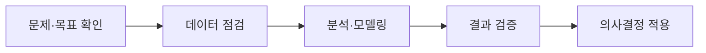

<Callout type="info">
  **이번 문서의 목표:** 분석 과제에 필요한 계획 요소를 정하고, 간단한 분석 로드맵을 만듭니다.
</Callout>

## 좋은 질문 다음에는 실행 계획이 필요하다

1편에서 분석 과제를 “누구의 어떤 문제를 무엇으로 확인할지”로 정리했습니다. 이제 그 질문을 실제 작업으로 옮겨야 합니다. 이때 필요한 것이 **분석 계획**입니다.

예를 들어 “다음 달 해지율을 낮추기 위해 해지 위험 회원을 찾는다”는 과제가 있다고 합시다. 계획에는 어떤 데이터를 언제까지 준비하고, 누가 어떤 결과를 받아 어떤 행동을 할지까지 들어가야 합니다.

| 계획 항목 | 질문 | 예 |
| --- | --- | --- |
| 목표 | 무엇을 개선할까? | 다음 달 해지율 감소 |
| 대상·기간 | 누구를 언제 볼까? | 최근 90일 유료 회원 |
| 데이터 | 무엇이 필요할까? | 이용 기록, 결제 이력, 해지 여부 |
| 결과물 | 무엇을 전달할까? | 위험 회원 목록과 원인 요약 |
| KPI | 성공을 어떻게 볼까? | 다음 달 해지율 |

## 목표와 KPI는 같은 말이 아니다

**목표**는 바꾸고 싶은 방향이고, **KPI**는 그 변화가 일어났는지 확인하는 숫자입니다.

- 목표: 다음 달 해지율을 낮춘다.
- KPI: 다음 달 해지율이 8%에서 6%로 낮아졌는지 본다.

KPI만 적고 기준 시점이 없으면 좋아졌는지 판단하기 어렵습니다. 그래서 현재 값, 목표 값, 측정 기간을 함께 정하는 것이 좋습니다.

| 항목 | 현재 | 목표 | 측정 시점 |
| --- | ---: | ---: | --- |
| 다음 달 해지율 | 8% | 6% 이하 | 혜택 적용 후 1개월 |
| 위험 회원 응답률 | 12% | 18% 이상 | 캠페인 기간 |

## 분석은 한 번에 완성되지 않는다

처음부터 복잡한 모델을 만들기보다, 확인 가능한 작은 단계로 나누는 편이 좋습니다.

1. **문제·목표 확인:** 어떤 결정을 돕는지, KPI가 무엇인지 합의합니다.
2. **데이터 점검:** 필요한 열이 있는지, 기간이 충분한지, 빠진 값은 없는지 확인합니다.
3. **분석·모델링:** 패턴을 찾고 필요하면 예측 모델을 만듭니다.
4. **결과 검증:** 결과가 믿을 만한지, KPI와 연결되는지 검토합니다.
5. **의사결정 적용:** 혜택 대상 선정처럼 실제 행동으로 옮깁니다.

## 우선순위는 효과와 실행 가능성을 함께 본다

할 수 있는 분석이 여러 개라면 효과만 보고 고르면 안 됩니다. 데이터가 없거나 너무 늦게 결과가 나오면 당장 쓸 수 없기 때문입니다.

| 과제 | 기대 효과 | 실행 가능성 | 우선순위 판단 |
| --- | --- | --- | --- |
| 해지 위험 회원 찾기 | 높음 | 높음: 이용·결제 데이터 있음 | 먼저 진행 |
| 감정 분석으로 불만 찾기 | 중간 | 낮음: 상담 텍스트 정제가 필요 | 다음 단계 |
| 전체 추천 모델 만들기 | 높음 | 낮음: 준비 기간이 김 | 장기 과제 |

**실행 가능성**은 데이터의 존재, 품질, 사람과 시간 같은 현실 조건을 모두 포함합니다.

<Callout type="warning">
  분석 결과물이 “정확도 90%”처럼 모델 숫자로만 끝나면 의사결정에 쓰기 어렵습니다. 누구에게 어떤 행동을 권할지, KPI가 어떻게 바뀌었는지까지 연결해야 합니다.
</Callout>

## 핵심 정리

- 분석 계획은 목표, 대상·기간, 데이터, 결과물, KPI를 정리한 실행 지도입니다.
- 목표는 방향이고 KPI는 목표 달성을 확인하는 숫자입니다.
- 분석은 데이터 점검부터 결과 적용까지 단계적으로 진행합니다.
- 우선순위는 기대 효과와 실행 가능성을 함께 고려합니다.

## 마무리 복습

<Quiz
  questionNumber={1}
  question="다음 중 분석 계획의 KPI로 가장 알맞은 것은?"
  options={['분석 담당자의 이름', '다음 달 해지율', '데이터 파일의 폴더명', '사용한 그래프 색상']}
  correctAnswer={2}
  explanation="다음 달 해지율은 목표가 달성됐는지 숫자로 확인할 수 있는 핵심 지표입니다."
  optionExplanations={[
    '담당자는 업무 배정 정보입니다.',
    '맞습니다. 해지를 줄이는 목표와 직접 연결됩니다.',
    '파일 위치는 작업 관리 정보입니다.',
    '그래프 색상은 표현 방식일 뿐 성과 지표가 아닙니다.',
  ]}
/>

<Quiz
  questionNumber={2}
  question="분석 로드맵에서 데이터 점검 단계에 가장 먼저 확인할 내용은 무엇인가요?"
  options={['로고 색상', '필요한 데이터가 실제로 있고 품질이 충분한지', '발표 자료의 글꼴', '가장 복잡한 알고리즘 이름']}
  correctAnswer={2}
  explanation="필요한 데이터가 없거나 품질이 낮으면 뒤 단계의 분석 결과도 신뢰하기 어렵습니다."
  optionExplanations={[
    '디자인 정보는 분석 데이터 점검과 관련이 없습니다.',
    '맞습니다. 데이터의 존재, 기간, 결측값 등을 확인합니다.',
    '발표 준비는 결과가 나온 뒤의 일입니다.',
    '알고리즘 선택은 문제와 데이터가 정리된 뒤에 합니다.',
  ]}
/>

<Quiz
  questionNumber={3}
  question="분석 과제의 우선순위를 정할 때 함께 고려해야 하는 두 가지는?"
  options={['글자 크기와 색상', '기대 효과와 실행 가능성', '파일 이름과 확장자', '표본 수와 행 수만']}
  correctAnswer={2}
  explanation="효과가 커도 데이터나 시간이 부족하면 당장 실행하기 어렵기 때문에 두 기준을 함께 봅니다."
  optionExplanations={[
    '문서 디자인 요소입니다.',
    '맞습니다. 가치와 현실적인 실행 조건을 함께 판단합니다.',
    '파일 관리 정보입니다.',
    '자료 규모만으로 사업 우선순위를 정할 수 없습니다.',
  ]}
/>

## 참고 자료

- [KDATA 데이터자격시험 - 빅데이터분석기사](https://www.dataq.or.kr/www/sub/a_07.do)
- [NIST/SEMATECH e-Handbook of Statistical Methods](https://www.itl.nist.gov/div898/handbook/)