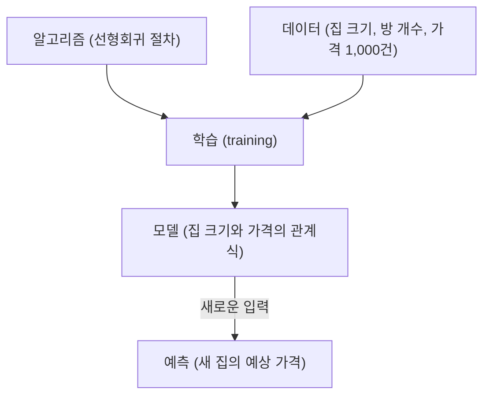

<Callout type="info">
  **이번 문서의 목표:** "알고리즘", "모델", "분류", "회귀", "특성", "레이블" 같은 단어를 뒤에서 볼 때마다 사전을 찾지 않고 바로 이해할 수 있게 됩니다.
</Callout>

## 왜 이 문서가 필요한가?

뒤에서 배울 문서(20~27번)의 제목만 봐도 "선형회귀", "의사결정나무", "군집분석", "특성 선택" 같은 낯선 단어가 가득합니다. 이 단어들은 사실 몇 개의 기본 개념만 알면 전부 서로 연결되어 이해가 쉬워집니다.

> **쉽게 말하면:** 이 문서는 뒤에 나올 모든 모델링 이야기를 읽기 위한 "단어장"입니다.

---

## 알고리즘(Algorithm)이란?

**알고리즘**은 문제를 푸는 **정해진 절차·규칙**입니다. 요리 레시피와 같습니다.

> **비유:** "라면 끓이기" 레시피는 "물을 끓인다 → 면을 넣는다 → 스프를 넣는다 → 4분 기다린다"처럼 순서가 정해져 있습니다. 알고리즘도 마찬가지로 "입력을 받아서 → 정해진 단계를 거쳐 → 결과를 낸다"는 절차입니다.

머신러닝에서 알고리즘은 "데이터에서 패턴을 찾아내는 절차"를 뜻합니다. 예: 선형회귀 알고리즘, 의사결정나무 알고리즘.

---

## 모델(Model)이란?

**모델**은 알고리즘이 데이터를 보고 학습한 **결과물**입니다.

> **비유:** 알고리즘이 "요리 레시피"라면, 모델은 그 레시피대로 실제로 만든 "완성된 음식"입니다. 같은 레시피(알고리즘)라도 어떤 재료(데이터)를 쓰느냐에 따라 결과(모델)가 달라집니다.

즉, **알고리즘(절차) + 데이터(재료) → 학습(과정) → 모델**(결과물) 순서입니다.

---

## 특성(Feature)과 레이블(Label)

표 형태의 데이터를 다룰 때, 열(Column)은 두 가지 역할로 나뉩니다.

| 역할 | 이름 | 뜻 | 예시 |
|------|------|-----|------|
| 입력으로 쓰는 열 | **특성**(Feature) | 예측에 사용하는 정보 | 집 크기, 방 개수, 지역 |
| 맞히려는 열 | **레이블**(Label), 목표변수 | 예측하고 싶은 정답 | 집값 |

| 집 크기(특성) | 방 개수(특성) | 지역(특성) | 집값(레이블) |
|---|---|---|---|
| 84㎡ | 3 | 강남 | 12억 |
| 59㎡ | 2 | 노원 | 5억 |
| 114㎡ | 4 | 강남 | 18억 |

> **쉽게 말하면:** 특성은 "문제(질문)", 레이블은 "정답"입니다. 모델은 문제(특성)를 보고 정답(레이블)을 맞히는 법을 배웁니다.

---

## 분류(Classification) vs 회귀(Regression)

레이블(맞히려는 정답)의 **형태**에 따라 문제 종류가 나뉩니다. 이 구분은 뒤에서 배울 모든 알고리즘 문서(20~27번)의 기준이 되므로 반드시 명확히 구분해야 합니다.

| 구분 | 레이블의 형태 | 질문 예시 | 답 예시 |
|------|-------------|-----------|---------|
| **분류**(Classification) | 범주(카테고리) | 이 이메일은 스팸인가? | "스팸" 또는 "정상" (둘 중 하나) |
| **회귀**(Regression) | 연속된 숫자 | 이 집은 얼마일까? | 5억 3,200만 원 (숫자) |

> **구별하는 방법:** 정답이 "예/아니오", "A/B/C" 처럼 **선택지**라면 분류, 정답이 "숫자 하나"라면 회귀입니다.

**헷갈리기 쉬운 예:**

- "내일 비가 올까?" → 분류 (온다/안 온다)
- "내일 강수량은 몇 mm일까?" → 회귀 (숫자)
- "이 고객은 이탈할까?" → 분류 (이탈/유지)
- "이 고객의 다음 달 예상 구매액은?" → 회귀 (숫자)

<Callout type="warning">
  **자주 틀리는 점:** "등급(1~5점)"처럼 숫자처럼 보여도 실제로는 순서가 있는 범주라면 분류로 다루는 경우가 많습니다. 반대로 "0 또는 1"이라도 확률처럼 연속적으로 다루면 회귀 기법(로지스틱 회귀)을 응용하기도 합니다. 문제의 목적을 먼저 파악해야 합니다.
</Callout>

---

## 지도학습 vs 비지도학습

데이터에 **정답(레이블)이 있는지 없는지**로 나뉩니다.

| 구분 | 정답 존재 여부 | 목표 | 예시 알고리즘 |
|------|--------------|------|--------------|
| **지도학습**(Supervised) | 있음 | 정답을 맞히는 규칙 학습 | 회귀, 의사결정나무, KNN |
| **비지도학습**(Unsupervised) | 없음 | 데이터 속 숨은 패턴·구조 발견 | 군집분석(K-means), 연관규칙 |

> **비유:** 지도학습은 "정답지가 있는 문제집"을 풀며 채점받는 것이고, 비지도학습은 "정답지 없이 데이터 더미를 던져주고 알아서 비슷한 것끼리 묶어보라"는 것과 같습니다.

---

## 파라미터(Parameter) vs 하이퍼파라미터(Hyperparameter)

이 둘은 이름이 비슷해서 자주 헷갈립니다.

| 구분 | 누가 정하나 | 언제 정해지나 | 예시 |
|------|-----------|-------------|------|
| **파라미터** | 모델이 데이터를 보고 스스로 계산 | 학습 도중 자동으로 | 회귀식의 계수 $b_0, b_1$ |
| **하이퍼파라미터** | 사람이 미리 설정 | 학습을 시작하기 전에 | 의사결정나무의 최대 깊이, K-means의 군집 개수 K |

> **비유:** 하이퍼파라미터는 "요리하기 전에 오븐 온도를 몇 도로 맞출지 사람이 정하는 것"이고, 파라미터는 "그 온도로 구운 결과, 빵의 색과 맛이 자동으로 정해지는 것"입니다.

---

## 핵심 정리

- **알고리즘**: 문제를 푸는 절차(레시피). **모델**: 알고리즘이 데이터로 학습한 결과물(완성된 요리).
- **특성**(Feature): 입력(문제). **레이블**(Label): 맞히려는 정답.
- **분류**: 정답이 범주(선택지). **회귀**: 정답이 연속된 숫자.
- **지도학습**: 정답 있음. **비지도학습**: 정답 없음.
- **파라미터**: 학습 중 자동 계산. **하이퍼파라미터**: 학습 전 사람이 설정.

---

## 마무리 복습

<Quiz
  questionNumber={1}
  question="알고리즘과 모델의 관계를 올바르게 설명한 것은?"
  options={['①알고리즘과 모델은 완전히 같은 개념이다', '②알고리즘은 절차이고, 모델은 그 알고리즘이 데이터를 학습한 결과물이다', '③모델이 먼저 있고 그 후 알고리즘이 만들어진다', '④알고리즘은 데이터이고 모델은 절차이다']}
  correctAnswer={2}
  explanation="알고리즘은 레시피(절차)이고, 그 레시피대로 실제 데이터를 학습시켜 나온 결과물이 모델입니다. 같은 알고리즘이라도 데이터가 다르면 다른 모델이 나옵니다."
  optionExplanations={['둘은 다른 개념입니다.', '맞습니다. 알고리즘(절차)으로 데이터를 학습해 모델(결과물)이 나옵니다.', '순서가 반대입니다. 알고리즘이 먼저 있고 학습을 거쳐 모델이 나옵니다.', '알고리즘이 절차이고 모델이 결과물입니다.']}
/>

<Quiz
  questionNumber={2}
  question="이 고객이 다음 달에 이탈할지 여부(예/아니오)를 예측하는 문제는?"
  options={['①회귀', '②분류', '③군집분석', '④연관규칙']}
  correctAnswer={2}
  explanation="정답이 '이탈/유지'라는 범주(선택지)이므로 분류 문제입니다. 정답이 숫자였다면 회귀입니다."
  optionExplanations={['회귀는 정답이 연속된 숫자일 때입니다.', '맞습니다. 정답이 범주(예/아니오)이므로 분류입니다.', '군집분석은 정답 없이 그룹을 나누는 비지도학습입니다.', '연관규칙도 비지도학습에 속합니다.']}
/>

<Quiz
  questionNumber={3}
  question="지도학습과 비지도학습을 구분하는 기준은?"
  options={['①데이터의 크기', '②정답(레이블)의 존재 여부', '③사용하는 프로그래밍 언어', '④분석에 걸리는 시간']}
  correctAnswer={2}
  explanation="지도학습은 정답이 있는 데이터로 학습하고, 비지도학습은 정답 없이 패턴을 찾습니다. 데이터 크기나 언어는 구분 기준이 아닙니다."
  optionExplanations={['데이터 크기는 구분 기준이 아닙니다.', '맞습니다. 정답 존재 여부가 핵심 기준입니다.', '프로그래밍 언어와 무관합니다.', '분석 시간은 구분 기준이 아닙니다.']}
/>

<Quiz
  questionNumber={4}
  question="집 크기, 방 개수로 집값을 예측하는 표에서 '집값'에 해당하는 것은?"
  options={['①특성(Feature)', '②레이블(Label)', '③파라미터', '④하이퍼파라미터']}
  correctAnswer={2}
  explanation="집값은 예측하려는 대상, 즉 정답이므로 레이블(목표변수)입니다. 집 크기와 방 개수는 예측에 사용하는 특성입니다."
  optionExplanations={['특성은 입력으로 쓰는 정보(집 크기, 방 개수)입니다.', '맞습니다. 예측하려는 정답이 레이블입니다.', '파라미터는 학습 중 자동 계산되는 값입니다.', '하이퍼파라미터는 학습 전 사람이 설정하는 값입니다.']}
/>

<Quiz
  questionNumber={5}
  question="의사결정나무의 '최대 깊이'를 사람이 3으로 미리 설정했다면, 이는 무엇에 해당하는가?"
  options={['①파라미터', '②하이퍼파라미터', '③레이블', '④특성']}
  correctAnswer={2}
  explanation="최대 깊이는 학습을 시작하기 전에 사람이 미리 정하는 값이므로 하이퍼파라미터입니다. 학습 중 데이터로부터 자동 계산되는 값은 파라미터입니다."
  optionExplanations={['파라미터는 데이터로부터 자동 계산되는 값입니다.', '맞습니다. 학습 전 사람이 설정하는 값은 하이퍼파라미터입니다.', '레이블은 예측하려는 정답입니다.', '특성은 입력으로 쓰는 정보입니다.']}
/>

<Quiz
  questionNumber={6}
  question="내일 강수량이 몇 mm일지 예측하는 문제는?"
  options={['①분류', '②회귀', '③군집분석', '④비지도학습']}
  correctAnswer={2}
  explanation="정답이 mm 단위의 연속된 숫자이므로 회귀 문제입니다. '비가 온다/안 온다'였다면 분류가 됩니다."
  optionExplanations={['분류는 정답이 범주(선택지)일 때입니다.', '맞습니다. 정답이 연속된 숫자이므로 회귀입니다.', '군집분석은 정답 없이 그룹을 나누는 기법입니다.', '이 문제는 정답(레이블)이 있으므로 지도학습입니다.']}
/>

---

## 참고 자료

- [한국데이터산업진흥원 빅데이터 자격 안내](https://www.dataq.or.kr)
- [구글 머신러닝 용어집 (한국어)](https://developers.google.com/machine-learning/glossary?hl=ko)
