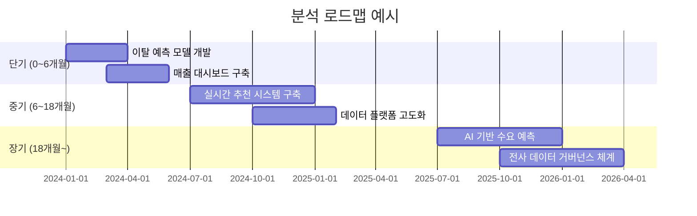

<Callout type="info">
  **이번 문서의 목표:** 여러 분석 과제가 쌓였을 때 어떤 것부터 해야 하는지, 우선순위 매트릭스와 로드맵으로 결정하는 방법을 익힙니다.
</Callout>

## 왜 분석 계획이 필요한가

조직에는 분석하고 싶은 과제가 항상 넘칩니다. 하지만 데이터 팀의 인력과 시간은 한정되어 있습니다. "다 중요하다"는 말은 곧 "아무것도 중요하지 않다"와 같습니다.

분석 계획의 핵심은 두 가지입니다.
1. **무엇을 먼저 할지** — 우선순위 결정
2. **언제까지 어떻게 할지** — 로드맵 수립

## 분석 우선순위 2×2 매트릭스

분석 과제의 우선순위는 **비즈니스 가치**와 **난이도**(IT 투자) 두 축으로 평가합니다.

| | **난이도 낮음 **(IT 투자 少) | **난이도 높음 **(IT 투자 多) |
|---|---|---|
| **비즈니스 가치 高** | ⭐ **1순위: 즉시 적용** | 🚀 **2순위: 중장기 계획** |
| **비즈니스 가치 低** | ✅ **3순위: 지속 과제** | ❌ **4순위: 보류** |

- **1순위 (즉시 적용):** 가치는 높고 하기 쉬운 과제. 가장 먼저 착수. 예) 기존 데이터로 간단한 이탈 예측 대시보드 구축
- **2순위 (중장기 계획):** 가치는 높지만 인프라나 데이터 구축이 필요. 예) 실시간 개인화 추천 시스템
- **3순위 (지속 과제):** 가치는 낮지만 쉽게 자동화 가능. 예) 주간 매출 리포트 자동화
- **4순위 (보류):** 가치도 낮고 하기도 어렵다. 지금은 하지 않는다.

<Callout type="warning">
  **시험 포인트:** 1순위는 "가치 高 + 난이도 低", 2순위는 "가치 高 + 난이도 高"입니다. 가치가 높은 과제를 먼저 해야 한다는 원칙을 기억하세요.
</Callout>

## 분석 로드맵: 단기·중기·장기

우선순위가 결정되면 시간 축에 따라 로드맵을 구성합니다.

| 구분 | 기간 | 특징 | 예시 과제 |
|------|------|------|----------|
| **단기** | 0~6개월 | 즉시 실행 가능, 빠른 성과 | 기존 데이터 활용 모델, 리포트 자동화 |
| **중기** | 6~18개월 | 인프라 투자 병행 | 실시간 처리 시스템, 데이터 품질 개선 |
| **장기** | 18개월 이상 | 조직 역량·문화 변화 포함 | AI 기반 의사결정 체계, 거버넌스 |

## 분석 성숙도 모델 4단계

조직의 데이터 분석 역량은 단계적으로 발전합니다. 현재 단계를 진단하고, 다음 단계로 올라가기 위한 계획을 세워야 합니다.

| 단계 | 명칭 | 특징 | 의사결정 방식 |
|------|------|------|--------------|
| 1단계 | **도입** | 데이터 수집 시작, 개별 분석 | 경험과 직관 중심 |
| 2단계 | **활용** | 정기 리포트, 대시보드 운영 | 과거 데이터 기반 사실 확인 |
| 3단계 | **확산** | 예측 모델, 다부서 분석 공유 | 통계 모델 기반 예측 |
| 4단계 | **최적화** | 실시간 분석, AI 기반 자동화 | 알고리즘이 의사결정 수행 |

<Callout type="info">
  대부분의 국내 기업은 2~3단계에 위치합니다. 4단계로 가려면 데이터 인프라뿐만 아니라 **조직 문화와 역량**의 변화가 함께 필요합니다.
</Callout>

## 포트폴리오 관점의 분석 과제 관리

분석 과제를 개별로 보지 않고, **포트폴리오 전체**로 바라보는 것이 중요합니다.

- **빠른 성과(Quick Win):** 단기적으로 성과를 보여줄 과제. 조직의 신뢰 확보에 중요
- **전략 과제:** 장기적 경쟁력을 위한 큰 과제. 투자와 인내가 필요
- **기반 과제:** 다른 분석의 토대가 되는 인프라·품질 개선. 직접 수익은 없지만 필수

포트폴리오를 구성할 때는 세 유형을 균형 있게 섞어야 합니다. 빠른 성과만 쫓으면 장기 경쟁력을 잃고, 전략 과제만 추구하면 조직의 지지를 잃습니다.

## 분석 계획서의 구성 요소

실제 분석 계획서에는 다음 항목이 포함됩니다.

1. **분석 과제 목록** — 정의된 모든 과제와 우선순위
2. **우선순위 매트릭스** — 가치·난이도 평가 결과
3. **로드맵** — 단기·중기·장기 일정
4. **자원 계획** — 인력, 예산, 인프라
5. **위험 요소** — 데이터 가용성, 인력 부족, 기술적 난이도
6. **성공 지표** — 각 과제별 KPI

## 핵심 정리

- 분석 우선순위는 **비즈니스 가치 × 난이도** 2×2 매트릭스로 결정한다
- **1순위: 가치 高·난이도 低 → 즉시 적용**, 2순위: 가치 高·난이도 高 → 중장기 계획
- 로드맵은 단기(0~6개월), 중기(6~18개월), 장기(18개월~)로 구분한다
- 분석 성숙도는 도입 → 활용 → 확산 → 최적화 4단계로 발전한다
- 분석 과제는 빠른 성과·전략 과제·기반 과제를 균형 있게 포트폴리오로 구성한다

## 마무리 복습

<Quiz
  questionNumber={1}
  question="분석 우선순위 2×2 매트릭스에서 '비즈니스 가치가 높고 난이도(IT 투자)가 낮은' 과제의 적절한 처리 방향은?"
  options={[
    '보류한다',
    '중장기 계획을 수립하여 단계적으로 추진한다',
    '즉시 적용한다',
    '지속 과제로 분류하여 천천히 진행한다'
  ]}
  correctAnswer={3}
  explanation="비즈니스 가치가 높고 난이도가 낮은 과제는 1순위로, '즉시 적용'하는 것이 맞습니다. 가장 효율적으로 빠른 성과를 낼 수 있는 과제이므로 가장 먼저 착수해야 합니다."
  optionExplanations={[
    '보류는 가치가 낮고 난이도가 높은 4순위 과제에 해당합니다.',
    '중장기 계획은 가치가 높지만 난이도도 높은 2순위 과제에 해당합니다.',
    '맞습니다. 가치 高 + 난이도 低는 1순위로 즉시 적용합니다.',
    '지속 과제는 가치가 낮고 난이도도 낮은 3순위 과제에 해당합니다.'
  ]}
/>

<Quiz
  questionNumber={2}
  question="분석 성숙도 모델의 단계를 순서대로 올바르게 나열한 것은?"
  options={[
    '최적화 → 확산 → 활용 → 도입',
    '도입 → 활용 → 확산 → 최적화',
    '활용 → 도입 → 확산 → 최적화',
    '도입 → 확산 → 활용 → 최적화'
  ]}
  correctAnswer={2}
  explanation="분석 성숙도 모델은 도입(데이터 수집 시작) → 활용(리포트·대시보드) → 확산(예측 모델·다부서 공유) → 최적화(실시간·AI 자동화) 순서로 발전합니다."
  optionExplanations={[
    '역순입니다.',
    '맞습니다. 도입 → 활용 → 확산 → 최적화가 올바른 순서입니다.',
    '활용과 도입의 순서가 바뀌었습니다.',
    '확산과 활용의 순서가 바뀌었습니다.'
  ]}
/>

<Quiz
  questionNumber={3}
  question="포트폴리오 관점의 분석 과제 관리에서 '기반 과제'에 대한 설명으로 옳은 것은?"
  options={[
    '단기적으로 빠른 수익을 창출하는 과제이다.',
    '직접적인 수익은 없지만 다른 분석의 토대가 되는 인프라·품질 개선 과제이다.',
    '장기적 경쟁력을 위한 AI 자동화 과제이다.',
    '조직의 신뢰 확보를 위한 시범 과제이다.'
  ]}
  correctAnswer={2}
  explanation="기반 과제는 직접적인 매출이나 비용 절감 효과가 바로 나타나지는 않지만, 데이터 인프라 구축이나 데이터 품질 개선처럼 다른 모든 분석 과제의 토대가 됩니다. 없으면 다른 과제도 제대로 진행하기 어렵습니다."
  optionExplanations={[
    '단기 수익 창출은 빠른 성과(Quick Win) 과제의 특징입니다.',
    '맞습니다. 기반 과제는 직접 수익은 없지만 다른 분석의 인프라가 됩니다.',
    'AI 자동화는 전략 과제에 해당합니다.',
    '조직 신뢰 확보를 위한 시범 과제는 빠른 성과(Quick Win)에 해당합니다.'
  ]}
/>

## 참고 자료

- [KDATA 데이터자격시험 - 빅데이터분석기사](https://www.dataq.or.kr/www/sub/a_07.do)
- [NIST/SEMATECH e-Handbook of Statistical Methods](https://www.itl.nist.gov/div898/handbook/)
