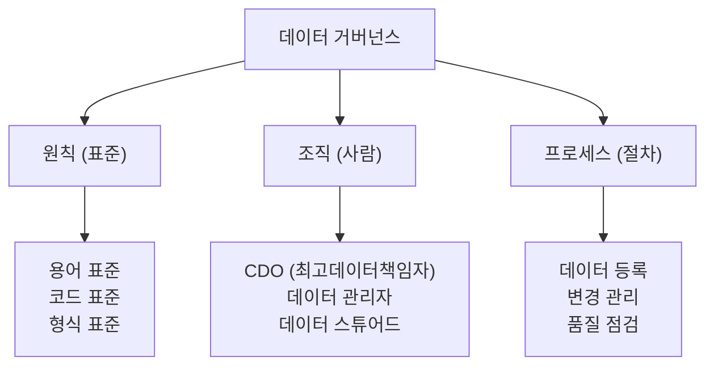

<Callout type="info">
  **이번 문서의 목표:** 데이터 거버넌스의 3요소와 데이터 품질 6개 차원을 이해하고, 조직이 데이터를 어떻게 체계적으로 관리하는지 파악합니다.
</Callout>

## 데이터 거버넌스란 무엇인가

**데이터 거버넌스**(Data Governance) 는 조직 내 데이터를 일관되게 정의·관리·활용하는 체계입니다.

거버넌스가 없으면 어떤 일이 생길까요?

- 마케팅팀의 "고객 수"와 영업팀의 "고객 수"가 다르다.
- 같은 제품을 어떤 시스템에는 "상품 코드 A001", 다른 시스템에는 "P-001"로 저장한다.
- 데이터가 누구 책임인지 몰라 오류를 발견해도 아무도 고치지 않는다.

데이터 거버넌스는 이런 혼란을 방지하고, 데이터를 신뢰할 수 있는 조직 자산으로 관리하는 것입니다.

## 거버넌스의 3가지 구성 요소

데이터 거버넌스는 **원칙, 조직, 프로세스** 세 가지가 맞물려야 작동합니다.

| 구성 요소 | 내용 | 예시 |
|---|---|---|
| **원칙**(표준) | 데이터를 어떻게 정의하고 표현할지의 규칙 | 날짜는 YYYY-MM-DD, 성별은 M/F |
| **조직**(사람) | 데이터 관리를 책임지는 역할과 권한 | CDO, 데이터 관리자, 데이터 스튜어드 |
| **프로세스**(절차) | 데이터를 등록·변경·폐기하는 관리 절차 | 신규 데이터 항목 등록 프로세스 |

## 데이터 표준화: 왜 중요한가

표준화는 같은 개념을 조직 전체에서 동일하게 표현하도록 규칙을 정하는 것입니다.

**용어 표준**
- 문제: 한 팀은 "고객", 다른 팀은 "회원", 또 다른 팀은 "사용자"
- 해결: 전사적으로 "고객(Customer)"으로 통일하고 정의 명확화

**코드 표준**
- 문제: 성별을 어떤 시스템은 M/F, 다른 시스템은 1/2, 또 다른 곳은 남/여
- 해결: 전사 코드 표준 정의 → 성별: M(남성), F(여성)

**형식 표준**
- 문제: 날짜가 20240115, 2024-01-15, 01/15/2024 등 제각각
- 해결: 날짜는 반드시 YYYY-MM-DD 형식 사용

## 메타데이터: 데이터에 대한 데이터

**메타데이터**(Metadata) 는 데이터를 설명하는 데이터입니다. 도서관의 책 목록(카탈로그)과 같습니다.

| 메타데이터 항목 | 내용 |
|---|---|
| **출처**(Source) | 이 데이터는 어디서 왔는가 |
| **정의**(Definition) | 이 항목이 의미하는 것은 무엇인가 |
| **형식**(Format) | 데이터 타입, 길이, 코드 규칙 |
| **갱신 주기**(Refresh Cycle) | 얼마나 자주 업데이트되는가 |
| **책임자**(Owner) | 누가 이 데이터를 관리하는가 |

메타데이터가 없으면 분석가는 컬럼명 `cust_tp_cd`가 무엇을 의미하는지 알 수 없습니다. 데이터 카탈로그 시스템(예: Apache Atlas, Datahub)이 메타데이터를 관리합니다.

## 데이터 품질 6개 차원

데이터 품질은 6가지 차원으로 평가합니다. 각각이 무엇인지, 어떤 문제가 발생하는지 알아야 합니다.

| 차원 | 영어 | 정의 | 문제 예시 |
|------|------|------|----------|
| **완전성** | Completeness | 필수 값이 빠짐없이 있는가 | 고객 테이블의 이메일 컬럼이 30% NULL |
| **정확성** | Accuracy | 실제 사실과 일치하는가 | 고객 주소가 5년 전 이사 전 주소로 남아 있음 |
| **일관성** | Consistency | 여러 시스템 간에 동일한 값인가 | CRM의 고객명과 ERP의 고객명이 다름 |
| **유효성** | Validity | 정해진 규칙(형식, 범위)을 따르는가 | 나이 컬럼에 -5, 999 같은 불가능한 값 |
| **유일성** | Uniqueness | 중복 없이 고유한가 | 같은 고객이 고객 테이블에 3개 행으로 존재 |
| **적시성** | Timeliness | 필요한 시점에 제공되는가 | 어제 거래 데이터가 다음날 오전 11시에야 제공 |

<Callout type="warning">
  **시험 포인트:** 6개 차원의 영어명과 정의를 짝지어 외워두세요. 특히 완전성(Completeness), 정확성(Accuracy), 일관성(Consistency)는 자주 출제됩니다.
</Callout>

## 데이터 품질 관리 프로세스

품질 문제를 발견하고 개선하는 것은 일회성이 아닌 지속적인 사이클입니다.

| 단계 | 내용 | 주요 활동 |
|------|------|----------|
| **1. 프로파일링** | 현재 품질 상태 측정 | NULL 비율, 중복 건수, 형식 오류 집계 |
| **2. 클렌징** | 발견된 문제 수정 | 중복 제거, 이상값 처리, 형식 표준화 |
| **3. 모니터링** | 품질 유지 여부 지속 확인 | 일별/주별 품질 지표 대시보드 운영 |

## 마스터 데이터 관리(MDM)

**MDM**(Master Data Management) 은 조직 내 핵심 참조 데이터(고객, 제품, 조직 등)를 단일 마스터 소스로 유지·관리하는 체계입니다.

- **문제:** 고객 정보가 CRM, ERP, 콜센터 시스템에 각각 다르게 저장됨
- **해결:** MDM 시스템이 단일 고객 레코드(Golden Record)를 유지하고, 모든 시스템이 이를 참조

MDM의 주요 대상 데이터: **고객(Customer), 제품(Product), 공급업체(Supplier), 조직**(Organization)

## 핵심 정리

- 데이터 거버넌스는 **원칙(표준), 조직(사람), 프로세스**(절차) 3요소로 구성된다
- 표준화는 **용어, 코드, 형식** 세 가지 측면에서 이루어진다
- 메타데이터는 **데이터에 대한 데이터** (출처, 정의, 형식, 갱신주기, 책임자)
- 데이터 품질 6차원: **완전성, 정확성, 일관성, 유효성, 유일성, 적시성**
- 품질 관리 사이클: **프로파일링 → 클렌징 → 모니터링**
- MDM: 핵심 데이터(고객, 제품)의 **단일 마스터**(Golden Record) 유지

## 마무리 복습

<Quiz
  questionNumber={1}
  question="데이터 품질 6개 차원 중 '여러 시스템 간에 동일한 값을 유지하는가'를 평가하는 차원은?"
  options={[
    '완전성(Completeness)',
    '정확성(Accuracy)',
    '일관성(Consistency)',
    '유효성(Validity)'
  ]}
  correctAnswer={3}
  explanation="일관성(Consistency)은 여러 시스템이나 데이터 소스 간에 동일한 데이터가 일치하는지를 평가합니다. 예를 들어, CRM 시스템의 고객명과 ERP 시스템의 고객명이 동일해야 일관성이 확보된 것입니다."
  optionExplanations={[
    '완전성은 필수 값이 빠짐없이 있는지(NULL 비율)를 평가합니다.',
    '정확성은 데이터가 실제 사실과 일치하는지를 평가합니다.',
    '맞습니다. 일관성은 여러 시스템 간 데이터 동일성을 평가합니다.',
    '유효성은 정해진 형식이나 범위 규칙을 따르는지를 평가합니다.'
  ]}
/>

<Quiz
  questionNumber={2}
  question="데이터 거버넌스의 3가지 구성 요소가 올바르게 묶인 것은?"
  options={[
    '데이터, 시스템, 분석',
    '원칙(표준), 조직(사람), 프로세스(절차)',
    '수집, 저장, 처리',
    '품질, 보안, 가용성'
  ]}
  correctAnswer={2}
  explanation="데이터 거버넌스의 3가지 구성 요소는 원칙(표준), 조직(사람), 프로세스(절차)입니다. 원칙은 데이터 표준 규칙, 조직은 CDO·데이터 스튜어드 등 책임 역할, 프로세스는 등록·변경·폐기 절차를 의미합니다."
  optionExplanations={[
    '데이터, 시스템, 분석은 거버넌스 구성 요소가 아닙니다.',
    '맞습니다. 원칙(표준), 조직(사람), 프로세스(절차)가 3대 구성 요소입니다.',
    '수집, 저장, 처리는 데이터 파이프라인의 단계입니다.',
    '품질, 보안, 가용성은 데이터 관리의 목표이지 거버넌스 구성 요소가 아닙니다.'
  ]}
/>

<Quiz
  questionNumber={3}
  question="MDM(마스터 데이터 관리)의 주요 목적은?"
  options={[
    '대용량 데이터를 빠르게 처리하기 위한 분산 저장 체계를 구축하는 것',
    '고객, 제품 등 핵심 데이터를 단일 마스터 소스로 유지하여 시스템 간 일관성을 확보하는 것',
    '데이터 분석 결과를 시각화하여 경영진에게 보고하는 것',
    '외부 데이터를 수집하고 내부 시스템과 연계하는 것'
  ]}
  correctAnswer={2}
  explanation="MDM(Master Data Management)은 고객, 제품, 조직 등 핵심 참조 데이터를 단일 마스터 레코드(Golden Record)로 유지하고, 모든 시스템이 이를 참조하게 하여 데이터 일관성을 확보하는 것이 목적입니다."
  optionExplanations={[
    '분산 저장 체계는 HDFS나 분산 데이터베이스의 역할입니다.',
    '맞습니다. MDM은 핵심 데이터의 단일 마스터 소스 유지와 시스템 간 일관성 확보가 목적입니다.',
    '분석 결과 시각화는 BI(Business Intelligence) 도구의 역할입니다.',
    '외부 데이터 수집·연계는 ETL이나 데이터 통합 솔루션의 역할입니다.'
  ]}
/>

## 참고 자료

- [KDATA 데이터자격시험 - 빅데이터분석기사](https://www.dataq.or.kr/www/sub/a_07.do)
- [NIST/SEMATECH e-Handbook of Statistical Methods](https://www.itl.nist.gov/div898/handbook/)
