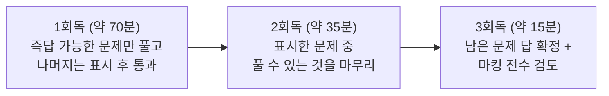
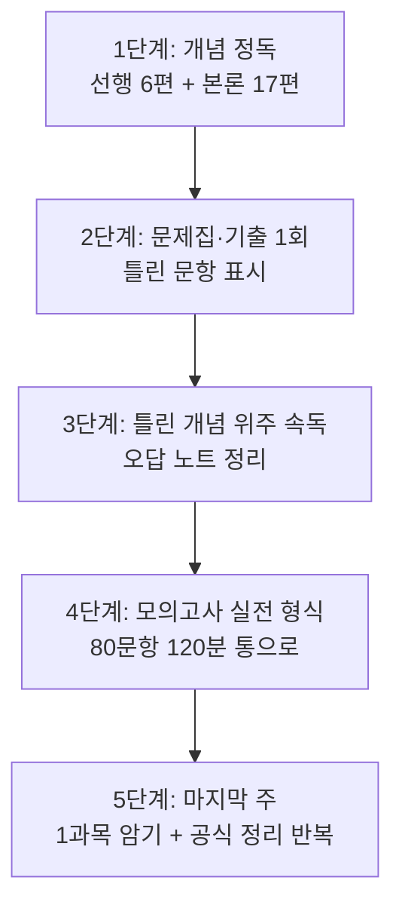

<Callout type="info">
  **이번 문서의 목표:** 자기 목표 점수와 과목별 시간 배분을 숫자로 세우고, 시험장에서 "이 문제를 붙잡을지 넘길지"를 즉시 판단하는 규칙을 갖게 된다.
</Callout>

## 왜 전략이 점수를 바꾸는가

같은 실력으로도 점수가 10점 이상 갈립니다. 이유는 대부분 셋 중 하나입니다.

- **시간 배분 실패** — 어려운 문제 하나에 5분을 쓰고 뒤쪽 쉬운 문제를 못 풀었다
- **공부 순서 실패** — 재미있는 과목만 파다가 1과목 암기를 미뤄 과락권에 들어갔다
- **오답 관리 실패** — 틀린 문제를 다시 틀리는 것을 반복했다

01편에서 확인한 합격 규칙(과목당 40점 이상 + 평균 60점 이상)을 다시 떠올려 봅시다. 이 규칙은 **"모든 과목에서 8문항 이상, 전체로 48문항 이상"** 이라는 뜻이었습니다. 이 편은 그 48문항을 어디서 어떻게 확보할지의 계획을 세웁니다.

> **쉽게 말하면:** 이 시험은 잘하는 과목을 더 잘하게 만드는 것보다, **못하는 과목을 최소선 위로 올리는 것**이 훨씬 효율적인 구조입니다.

## 1. 과목별 성격과 필요한 공부법

과목마다 요구하는 능력이 달라서 같은 공부법을 쓰면 안 됩니다.

| 과목 | 성격 | 필요한 공부 | 시간 투자 특성 |
|------|------|-------------|----------------|
| 1과목 분석 기획 | 용어·제도 **암기** 영역 | 정의를 정확히 외우고 비슷한 용어 쌍 구분 | 초반엔 느리다가 어느 순간 급격히 오름 |
| 2과목 탐색 | 개념 **이해** + 계산 | 전처리 판단 기준, 통계량 손계산 | 꾸준히 비례해서 오름 |
| 3과목 모델링 | 개념 **이해** 영역 | 알고리즘 원리와 장단점, 문제 유형 판정 | 개념 지도가 잡히면 빨리 오름 |
| 4과목 결과 해석 | 계산 + **해석** | 평가지표 공식과 계산, 시각화·활용 함정 | 공식만 외워도 상당 부분 확보 |

### 1과목이 가장 위험한 이유

의외로 과락이 자주 나오는 곳은 통계가 아니라 **1과목**입니다. 이유가 셋 있습니다.

- **이해로 메울 수 없습니다.** 가명정보와 익명정보 중 무엇이 개인정보에 해당하는지는 추론으로 알 수 없고, 정의를 외웠는지로만 갈립니다
- **비슷한 용어가 많습니다.** 집중구조·기능구조·분산구조, KDD·CRISP-DM·SEMMA, 마스킹·범주화·총계처리·라운딩처럼 이름이 비슷한 묶음이 계속 나옵니다
- **재미가 없어 미룹니다.** 그래서 마지막까지 남겨졌다가 시간이 부족해집니다

**대응:** 1과목은 **가장 먼저 시작하고, 가장 자주 반복**합니다. 하루 15분씩이라도 계속 접촉하는 것이, 마지막 주에 몰아서 하는 것보다 훨씬 효과적입니다.

### 2·3·4과목은 왜 이해 영역인가

이 세 과목은 문장을 외워도 새 상황으로 감싸서 나오면 못 풉니다. 예를 들어 "평균이 중앙값보다 크면 오른쪽 꼬리"라는 문장 하나를 외웠어도, 기출은 이렇게 냅니다.

> 관측값 11, 12, 12, 13, 14, 15, 41에 관한 설명으로 옳지 않은 것은? … "높은 극단값이 있으므로 분포는 왼쪽으로 치우친다"

이 문제를 풀려면 **왜 높은 극단값이 오른쪽 꼬리를 만드는지**를 이해하고 있어야 합니다(02편). 그래서 이 세 과목은 "왜"를 한 번은 짚고 넘어가야 하고, 그 대신 한 번 잡히면 오래 갑니다.

## 2. 문제 유형별 대응

기출을 유형으로 나누면 대응이 명확해집니다.

| 유형 | 형태 | 비중 감각 | 대응 |
|------|------|-----------|------|
| 단순 정의형 | "…을 무엇이라 하는가" | 큼 | 즉답. 15초 안에 끊고 넘어간다 |
| 옳지 않은 것 찾기 | "설명으로 옳지 않은 것은" | 매우 큼 | 보기 4개를 각각 참·거짓 판정 |
| 사례 판단형 | 상황을 주고 "가장 적절한 조치는" | 큼 | 상황의 조건을 먼저 정리 후 판정 |
| 짝짓기형 | 지표·요소를 서로 연결 | 중간 | 하나씩 대응시키고 하나라도 틀리면 탈락 |
| 계산형 | 통계량·평가지표 계산 | 중간 | 공식 → 대입 → 값 → 보기 대조 |

### "옳지 않은 것" 문제를 푸는 방법

이 시험에서 가장 많이 나오는 형태이고, 실수도 가장 많이 나옵니다.

<Steps>

1. **문제에서 "옳지 않은"에 표시부터 한다.** 급하면 "옳은 것"으로 잘못 읽어 정반대 답을 고릅니다
2. **보기 1번부터 순서대로 참·거짓을 판정**하고 여백에 O·X를 적습니다
3. **X가 하나면 그것이 답**입니다. X가 둘 이상이면 문제를 잘못 읽었거나 지식이 잘못된 것이니 다시 봅니다
4. **O가 셋, X가 하나로 딱 떨어지지 않으면** 표시하고 넘어갑니다

</Steps>

**왜 이렇게 하는가:** 머리로만 판정하면 3번 보기를 읽는 동안 1번 보기의 판정을 잊습니다. 손으로 O·X를 적으면 판정이 고정되어 되돌아가는 시간이 사라집니다.

### 사례 판단형을 푸는 방법

최근 회차일수록 이 유형이 늘고 있습니다. 형태는 이렇습니다.

> 상품 등록 품질 카드에 필수값 기록률 97퍼센트와 운영 승인 기준 98퍼센트 이상이 제시되어 있다. 이 카드가 뜻하는 품질 차원과 게이트 결론을 올바르게 짝지은 것은?

**핵심은 보기가 두 축으로 만들어져 있다**는 점입니다. 여기서는 (품질 차원) × (승인/보류)의 조합입니다. 그래서 이렇게 풉니다.

<Steps>

1. **축을 분리한다.** 이 문제는 "차원이 무엇인가"와 "승인할 것인가"의 두 질문입니다
2. **각 축을 독립적으로 판정한다.** 기록 여부 → 완전성. 97이 98보다 작음 → 보류
3. **두 판정을 모두 만족하는 보기를 고른다**

</Steps>

**함정 구조:** 오답 보기는 대개 "차원은 맞는데 결론이 틀린 것"과 "결론은 맞는데 차원이 틀린 것"으로 구성됩니다. 한 축만 보고 고르면 반드시 걸립니다.

### 계산형을 푸는 방법

계산 문제는 겁먹을 필요가 없습니다. 이 시험의 계산은 **공식을 알면 30초 안에 끝나는 수준**입니다.

<Steps>

1. **무엇을 묻는지 확인**하고 필요한 공식을 떠올린다
2. **주어진 값을 공식에 대응**시킨다. 이때 어떤 값이 분모인지 헷갈리면 반드시 종이에 쓴다
3. **계산한다.** 중간 결과도 적어 둔다
4. **보기와 대조**한다. 보기에는 흔한 실수 결과가 오답으로 배치되어 있으므로, 내 답이 보기에 있다고 안심하면 안 된다

</Steps>

**오답 보기의 구조를 알면 검산이 됩니다.** 예를 들어 표본분산 문제에서 보기에 36.5와 29.2가 함께 있다면, 29.2는 $n-1$ 대신 $n$으로 나눈 결과입니다. **보기끼리의 관계가 곧 출제자가 노리는 실수**이므로, 내 답의 이웃 보기가 어떤 실수의 결과인지 살펴보면 자기 계산을 검증할 수 있습니다.

## 3. 시험 중 시간 배분

01편에서 계산했듯 문항당 평균 90초이고, 검토 시간 15분을 빼면 약 79초입니다. 이 숫자를 그대로 쓰기보다 **문제 유형별로 다르게 배분**합니다.

| 유형 | 목표 시간 | 근거 |
|------|-----------|------|
| 단순 정의형 | 15–20초 | 알면 즉답, 모르면 어차피 오래 봐도 모름 |
| 옳지 않은 것 찾기 | 60–90초 | 보기 4개를 각각 판정해야 함 |
| 사례 판단형 | 90–120초 | 상황 정리 + 두 축 판정 |
| 계산형 | 60–90초 | 공식이 떠오르면 빠름 |

### 3회독 전략

전체를 한 번에 완벽히 풀려 하지 말고, **세 번 훑는 방식**을 씁니다.

**왜 이렇게 하는가:** 어려운 문제에 매달리면 두 가지를 잃습니다. 시간과 심리적 안정입니다. 1회독에서 쉬운 문제를 다 확보하면 "이미 40개는 맞혔다"는 감각이 생겨 남은 문제를 침착하게 볼 수 있습니다. 반대로 3번 문제에서 막혀 5분을 쓰면, 남은 77문항 내내 쫓기게 됩니다.

**표시 규칙을 정해 두세요.**

- 원(O) 표시: 조금만 더 보면 풀릴 것 같은 문제 → 2회독에서 처리
- 삼각형 표시: 전혀 모르겠는 문제 → 3회독에서 찍고 넘어감

### 넘길지 말지의 판단 기준

시험장에서 가장 어려운 판단입니다. 기준을 미리 정해 두세요.

> **한 문제에 90초를 썼는데 보기 두 개로 좁혀지지 않으면 무조건 표시하고 넘어간다.**

**왜 90초인가:** 문항당 평균 예산이 79초인데, 한 문제에 3분을 쓰면 다른 두 문제의 시간을 통째로 가져다 쓴 것입니다. 그 3분짜리 문제는 5점이고, 넘어가서 확보할 수 있었던 두 문제도 각각 5점입니다. **어려운 1문제와 쉬운 2문제를 맞바꾸는 선택**이 되므로 명백한 손해입니다.

## 4. 과락 방지 — 시험 중 자가 점검

과목이 순서대로 배치되어 있으므로, 각 과목을 끝낼 때마다 스스로 점검할 수 있습니다.

<Steps>

1. **한 과목(20문항)을 끝낼 때마다 "확신하는 문항 수"를 센다**
2. **확신 문항이 8개 미만이면** 그 과목의 표시 문제를 2회독 우선순위 맨 앞에 둔다
3. **확신 문항이 13개 이상이면** 그 과목은 그대로 두고 다음 과목으로 넘어간다

</Steps>

**왜 필요한가:** 과락은 특정 과목에서만 발생합니다. 만약 3과목이 유난히 어려워서 확신 문항이 6개라면, 남은 시간의 우선순위를 그 과목에 몰아야 합니다. 다른 과목에서 15개를 20개로 올리는 것보다 3과목에서 6개를 9개로 올리는 것이 **합격 여부 자체를 바꿉니다.**

## 5. 시험 전 학습 계획

### 순서

**각 단계의 목적:**

- **1단계 개념 정독:** 처음부터 문제부터 풀면 무엇을 모르는지도 모릅니다. 개념을 한 번은 끝까지 통과해야 합니다
- **2단계 문제 풀이:** 여기서 중요한 것은 점수가 아니라 **틀린 문항이 어느 개념인지 분류하는 것**입니다
- **3단계 속독:** 맞힌 개념은 건너뛰고 틀린 개념만 다시 봅니다. 시간 대비 효율이 가장 높은 구간입니다
- **4단계 모의고사:** 120분을 통으로 앉아 있는 연습이 필요합니다. 실제로 80문항을 연속으로 풀면 후반부 집중력이 떨어진다는 것을 미리 겪어 봐야 합니다
- **5단계 마무리:** 1과목 용어와 계산 공식은 **가장 마지막에 다시 보는 것**이 기억에 유리합니다

### 오답 노트를 만드는 법

오답 노트는 문제를 베껴 적는 것이 아닙니다. 그렇게 만들면 시간만 쓰고 다시 안 봅니다.

| 적을 것 | 적지 말 것 |
|---------|-----------|
| 틀린 이유 한 줄 (예: 표본분산을 n으로 나눔) | 문제 전문 베끼기 |
| 헷갈린 개념 쌍 (예: 가명정보와 익명정보) | 이미 아는 개념 정리 |
| 공식과 대입 순서 | 해설 통째 복사 |
| 어느 과목·세부 항목인지 | 관련 없는 배경 지식 |

**왜 "틀린 이유"가 핵심인가:** 같은 개념을 같은 방식으로 반복해서 틀립니다. "표본분산에서 $n-1$" 을 한 번 틀린 사람은 두 달 뒤에도 같은 자리에서 틀립니다. 그 실수 자체를 목록으로 만들어 시험 전날 훑는 것이 오답 노트의 유일한 목적입니다.

### 기출 활용법

**하지 말아야 할 것:** 기출 문제와 답을 통째로 외우는 것입니다. 이 시험은 같은 개념을 매 회차 다른 상황으로 감싸서 내기 때문에, 문제를 외운 사람은 조금만 바뀌어도 못 풉니다.

**해야 할 것:** 기출 한 문항을 볼 때마다 다음 세 가지를 뽑아냅니다.

<Steps>

1. **이 문제가 묻는 개념은 무엇인가** — 문제의 상황이 아니라 개념 이름으로 적는다
2. **오답 보기는 어떤 오해를 노렸는가** — 이것이 다음 회차에 정답 보기로 뒤집혀 나올 수 있다
3. **같은 개념을 다르게 물으면 어떻게 될까** — 스스로 변형 문제를 상상해 본다

</Steps>

**해석:** 3번이 가장 중요합니다. 예를 들어 "가명정보는 개인정보에 해당하는가"를 묻는 문제를 봤다면, 다음 회차에는 "익명정보는 개인정보에 해당하는가", "가명처리한 정보를 동의 없이 활용할 수 있는가"로 나올 수 있습니다. **한 문제에서 세 문제를 뽑아 두는 것**이 기출 활용의 핵심입니다.

## 6. 목표 점수 설계표

01편의 계산을 바탕으로, 자기 상황에 맞는 목표를 골라 두세요.

| 상황 | 1과목 | 2과목 | 3과목 | 4과목 | 합계 | 평균 | 여유 |
|------|-------|-------|-------|-------|------|------|------|
| 비전공·처음 준비 | 12 | 13 | 12 | 13 | 50 | 62.5 | 2문항 |
| 통계 배경 있음 | 12 | 15 | 14 | 15 | 56 | 70 | 8문항 |
| 관련 자격 보유 | 14 | 15 | 14 | 15 | 58 | 72.5 | 10문항 |

**해석:** 어떤 상황이든 **1과목 목표가 12문항 이상**이라는 점에 주목하세요. 통계 배경이 있는 사람도 1과목을 8~9개로 잡으면 안 됩니다. 암기 영역이라 노력 대비 확보가 확실한 반면, 버리면 그대로 과락 위험이 되기 때문입니다.

**자주 틀리는 판단:** "3과목이 어려우니 3과목을 포기하고 다른 데서 만회하자"는 전략은 성립하지 않습니다. 3과목에서 8개 미만이면 다른 과목 점수와 무관하게 불합격이기 때문입니다. **포기 가능한 과목은 없고, 다만 목표치를 낮게 잡을 수 있는 과목이 있을 뿐**입니다.

## 핵심 정리

- 1과목은 암기 영역이라 가장 먼저 시작하고 자주 반복해야 하며, 2·3·4과목은 이해 영역이라 "왜"를 한 번은 짚어야 한다.
- "옳지 않은 것" 문제는 보기마다 O·X를 손으로 적어 판정하고, 사례 판단형은 **두 축을 분리해 각각 판정**한 뒤 둘 다 맞는 보기를 고른다.
- 시험은 **3회독 전략**으로 운영한다. 즉답 문제를 먼저 쓸어 담고, 한 문제에 90초를 넘기면 표시 후 넘어간다.
- 과목이 끝날 때마다 확신 문항 수를 세어, **8개 미만인 과목에 남은 시간을 우선 배분**한다.
- 오답 노트에는 문제가 아니라 **틀린 이유 한 줄과 헷갈린 개념 쌍**을 적는다.
- 기출은 답을 외우는 것이 아니라, 한 문항에서 개념·오답의 노림수·변형 가능성 세 가지를 뽑아내는 데 쓴다.

## 마무리 복습

<Quiz
  questionNumber={1}
  question="필기 시험 중 한 문제에 오래 붙잡히는 상황에 대한 대응으로 가장 적절한 것은?"
  options={['모든 문항의 배점이 같으므로 일정 시간이 지나면 표시하고 넘어간다', '어려운 문제일수록 배점이 높으므로 끝까지 붙잡는다', '앞에서부터 순서대로 완벽히 풀고 넘어간다', '어려운 문제는 처음부터 읽지 않고 모두 찍는다']}
  correctAnswer={1}
  explanation="모든 문항이 5점으로 동일하므로 어려운 한 문제에 시간을 쓰면 쉬운 여러 문제를 잃는다. 배점 차이는 없으며, 아예 읽지 않고 찍는 것도 풀 수 있었던 문제를 버리는 손해다."
  optionExplanations={['배점이 동일하므로 시간 대비 효율을 기준으로 넘기는 것이 옳다.', '문항별 배점 차이가 없으므로 어려운 문제를 붙잡을 이유가 없다.', '순서대로 완벽히 푸는 방식은 뒤쪽 쉬운 문제를 놓치게 만든다.', '읽어야 즉답 가능한 문제인지 알 수 있으므로 전부 찍는 것은 손해다.']}
/>

<Quiz
  questionNumber={2}
  question="네 과목 중 한 과목만 유난히 어려워 확신 문항이 6개인 상황에서 남은 시간의 우선순위로 가장 적절한 것은?"
  options={['가장 자신 있는 과목의 점수를 더 올린다', '확신 문항이 6개인 과목의 표시 문제를 먼저 처리한다', '모든 과목에 시간을 균등하게 나눈다', '남은 시간을 마킹 검토에만 사용한다']}
  correctAnswer={2}
  explanation="과목당 40점 미만이면 다른 과목 점수와 무관하게 불합격이므로, 과락 위험 과목을 최소선 위로 올리는 것이 합격 여부를 직접 바꾼다. 자신 있는 과목의 추가 점수는 이미 충족된 조건을 더 채우는 것에 불과하다."
  optionExplanations={['평균은 이미 확보되어 있을 가능성이 높고 과락 위험은 해소되지 않는다.', '과락 위험 과목을 우선하는 것이 합격 여부를 바꾸므로 옳다.', '균등 배분은 과락 위험을 방치하는 결과가 된다.', '검토도 필요하지만 과락 위험 과목의 미해결 문제가 우선이다.']}
/>

<Quiz
  questionNumber={3}
  question="기출문제 활용 방법으로 가장 적절하지 않은 것은?"
  options={['문제가 묻는 개념을 개념 이름으로 정리한다', '오답 보기가 노린 오해가 무엇인지 분석한다', '같은 개념을 다르게 묻는 변형을 상상해 본다', '문제와 정답 번호를 그대로 외워 시험장에서 재사용한다']}
  correctAnswer={4}
  explanation="이 시험은 같은 개념을 매 회차 다른 상황으로 감싸 출제하므로 문제와 답을 통째로 외우는 방식은 통하지 않는다. 개념 추출, 오답 분석, 변형 상상이 실제로 점수를 만드는 활용법이다."
  optionExplanations={['개념 단위로 정리하면 변형 출제에도 대응할 수 있으므로 적절하다.', '오답의 노림수는 다음 회차에 정답으로 뒤집힐 수 있어 분석 가치가 크다.', '변형을 상상하면 한 문제에서 여러 문제를 대비할 수 있어 적절하다.', '상황을 바꿔 출제하는 시험이므로 답 번호 암기는 효과가 없다.']}
/>

<Quiz
  questionNumber={4}
  question="옳지 않은 것을 고르는 문항을 풀 때 권장되는 절차로 가장 적절한 것은?"
  options={['눈으로만 훑고 가장 어색해 보이는 보기를 바로 고른다', '보기마다 참·거짓을 표시하며 판정하고 거짓이 하나인지 확인한다', '보기 1번과 2번만 비교하고 나머지는 읽지 않는다', '가장 긴 보기를 정답으로 선택한다']}
  correctAnswer={2}
  explanation="보기마다 O와 X를 적어 판정하면 판정이 고정되어 되돌아가는 시간이 줄고, 거짓이 하나로 떨어지는지 확인하면 문제를 잘못 읽었는지도 검증된다. 보기 길이나 인상으로 고르는 방식은 함정에 걸리기 쉽다."
  optionExplanations={['인상만으로 고르면 미묘하게 다른 보기들 사이에서 실수하기 쉽다.', '보기별 판정과 거짓 개수 확인은 오독까지 걸러주므로 가장 적절하다.', '나머지 보기를 읽지 않으면 정답을 놓칠 수 있다.', '보기 길이는 정답과 아무 관련이 없다.']}
/>

<Quiz
  questionNumber={5}
  question="오답 노트 작성 방법으로 가장 효과적인 것은?"
  options={['문제 전문과 해설을 그대로 옮겨 적는다', '틀린 이유 한 줄과 헷갈린 개념 쌍을 기록한다', '맞힌 문제까지 모두 정리해 완성도를 높인다', '오답 노트는 만들지 않고 문제집을 반복해서 처음부터 다시 푼다']}
  correctAnswer={2}
  explanation="같은 개념을 같은 방식으로 반복해서 틀리기 때문에 실수의 원인 자체를 목록화해야 한다. 문제 전문 필사나 맞힌 문제 정리는 시간만 소모하며 반복 실수를 줄이는 데 기여하지 못한다."
  optionExplanations={['필사는 시간이 많이 들고 다시 보게 되지 않는 경우가 많다.', '반복 실수의 원인을 짧게 남기는 것이 오답 노트의 핵심 목적이다.', '이미 맞힌 개념 정리는 시간 대비 효율이 낮다.', '전체 반복은 이미 아는 부분에도 같은 시간을 쓰게 되어 비효율적이다.']}
/>

<Quiz
  questionNumber={6}
  question="빅데이터분석기사 필기 과목별 성격에 대한 설명으로 옳지 않은 것은?"
  options={['1과목은 용어와 제도의 정확한 암기 비중이 크다', '2과목은 개념 이해와 계산이 함께 요구된다', '3과목은 알고리즘의 원리와 문제 유형 판정이 중요하다', '4과목은 암기가 전혀 필요 없고 계산만으로 해결된다']}
  correctAnswer={4}
  explanation="4과목은 평가지표 계산이 큰 비중을 차지하지만 시각화 원칙, 결과 활용, 편향과 개인정보 같은 개념 이해와 암기도 함께 요구된다. 나머지 세 설명은 각 과목의 실제 성격과 일치한다."
  optionExplanations={['1과목은 정의 암기로 갈리는 문항이 많으므로 옳은 설명이다.', '2과목은 전처리 판단과 통계 계산이 함께 나오므로 옳은 설명이다.', '3과목은 알고리즘 원리와 문제 유형 판정이 핵심이므로 옳은 설명이다.', '4과목에도 시각화 원칙과 활용·윤리 개념이 포함되므로 이 설명이 틀렸다.']}
/>

<Quiz
  questionNumber={7}
  question="사례 판단형 문항을 푸는 방법으로 가장 적절한 것은?"
  options={['보기를 먼저 읽고 가장 그럴듯한 문장을 고른다', '상황이 요구하는 판단 축을 분리해 각각 판정한 뒤 모두 맞는 보기를 고른다', '숫자가 포함된 보기를 우선적으로 선택한다', '가장 짧은 보기를 선택한다']}
  correctAnswer={2}
  explanation="사례 판단형 보기는 대개 두 축의 조합으로 만들어져 한 축만 맞는 오답이 섞여 있다. 축을 분리해 각각 판정한 뒤 둘 다 만족하는 보기를 고르면 이 함정을 피할 수 있다."
  optionExplanations={['그럴듯함으로 고르면 한 축만 맞는 오답에 걸리기 쉽다.', '축 분리 판정은 이 유형의 함정 구조를 정확히 겨냥한 방법이다.', '숫자 포함 여부는 정답과 무관하다.', '보기 길이는 정답과 무관하다.']}
/>

## 참고 자료

- [Statistics Playbook - 빅데이터분석기사 완전 가이드](https://statisticsplaybook.com/big-data-analysis-engineer-guide/)
- [SQLDpass - 빅데이터분석기사 필기 기출·복원](https://www.sqldpass.com/past-exams?cert=BIGDATA_ANALYST)
- [요즘픽 - 빅데이터분석기사 필기 시험 구성과 출제 방향](https://yojumpick.com/articles/bigdata-analyst-written-exam/)
- [Inflearn 가이드 - 빅데이터분석기사 어떻게 준비해야 할까?](https://www.inflearn.com/pages/bigdata-analysis-engineer-guide)
