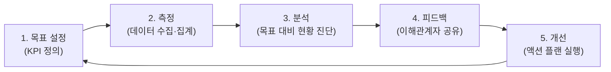

<Callout type="info">
  **이번 문서의 목표:** 분석 과제의 성과를 측정하고 관리하는 KPI 설계 방법, ROI 계산, 성과 관리 순환 체계를 이해합니다.
</Callout>

## KPI란 무엇인가

**KPI(Key Performance Indicator, 핵심 성과 지표)** 는 목표 달성 여부를 확인하는 핵심적인 측정 지표입니다.

모든 숫자가 KPI가 될 수 있는 것은 아닙니다. KPI는 조직의 전략 목표와 직접 연결되고, 행동 변화를 이끌어낼 수 있어야 합니다.

- 단순 지표(Metric): "이번 달 방문자 수 = 100만"
- KPI: "신규 가입 전환율이 목표 대비 92% 달성 → 회원가입 UX 개선 필요"

## SMART 원칙: 좋은 KPI의 조건

좋은 KPI는 **SMART** 원칙을 만족해야 합니다.

| 알파벳 | 원칙 | 의미 | 나쁜 예 | 좋은 예 |
|--------|------|------|--------|--------|
| **S** | Specific (구체적) | 모호함 없이 명확하게 | "고객 만족을 높인다" | "NPS 점수를 75 이상으로 올린다" |
| **M** | Measurable (측정 가능) | 수치로 측정할 수 있어야 | "분석을 잘한다" | "모델 AUC 0.80 이상 달성" |
| **A** | Achievable (달성 가능) | 현실적으로 달성 가능한 수준 | "해지율 0%로 낮춘다" | "해지율을 현재 대비 5%p 감소" |
| **R** | Relevant (관련성) | 조직 목표와 연결된 지표 | "서버 응답 속도 (분석팀 KPI)" | "추천 클릭률 → 매출 연결" |
| **T** | Time-bound (기한) | 목표 달성 시점이 명확 | "빨리 개선한다" | "다음 분기(Q3) 말까지" |

## 좋은 KPI vs 나쁜 KPI 예시

| 구분 | 나쁜 KPI 예시 | 좋은 KPI 예시 |
|------|-------------|--------------|
| **이탈 방지** | "고객 이탈을 줄인다" | "90일 이내 재방문율을 현재 42%에서 50%로 Q3까지 높인다" |
| **추천 시스템** | "추천을 더 잘한다" | "추천 클릭률(CTR)을 3.2%에서 4.5%로 2개월 내 개선한다" |
| **데이터 품질** | "데이터를 깨끗이 한다" | "필수 필드 완전성(Completeness)을 95% 이상으로 다음 달까지 유지한다" |
| **분석 속도** | "분석을 빠르게 한다" | "대시보드 로딩 시간을 현재 8초에서 3초 이하로 이번 달까지 단축한다" |

## 분석 성과 측정: ROI

분석 과제의 비즈니스 가치를 수치로 증명하려면 ROI를 계산해야 합니다.

$$
\text{ROI} = \frac{\text{수익} - \text{비용}}{\text{비용}} \times 100\%
$$

**예시:** 이탈 방지 모델 도입
- 투입 비용: 인력 3개월 (3,000만 원) + 인프라 (500만 원) = 3,500만 원
- 이탈 방지로 유지된 고객 연 구독료: 1억 2,000만 원
- ROI = (12,000 - 3,500) / 3,500 × 100 = **243%**

분석 성과 측정의 4가지 관점:

| 관점 | 측정 방법 | 예시 |
|------|----------|------|
| **비용 절감** | 자동화 전후 운영 비용 비교 | 월 보고서 자동화로 분석가 80시간/월 절감 |
| **매출 증가** | 모델 적용 전후 매출 비교 | 개인화 추천으로 구매 전환율 1.3%p 상승 |
| **운영 효율** | 처리 시간, 오류율 감소 | 재고 예측으로 품절률 15% → 8% |
| **의사결정 속도** | 보고서 생성 주기 단축 | 주간 보고서 → 실시간 대시보드 |

## 분석 결과 활용 유형

| 활용 유형 | 설명 | 예시 |
|---|---|---|
| **즉각 적용 (의사결정 지원)** | 분석 결과가 실시간·즉시 의사결정에 사용됨 | 고객 이탈 예측 점수로 당일 혜택 발송 |
| **간접 활용 (전략 수립)** | 분석 인사이트가 중장기 전략에 반영됨 | 세그먼트 분석 결과로 내년 마케팅 전략 수립 |
| **자동화 의사결정** | 분석 모델이 자동으로 결정을 내림 | 신용 대출 자동 심사 알고리즘 |

## 성과 관리 순환 체계

성과 관리는 일회성이 아닌 **지속적인 순환**입니다.

## 분석 거버넌스

**분석 거버넌스** 는 조직 내 분석 활동을 체계적으로 관리하는 구조입니다. 데이터 거버넌스가 데이터 자산 관리라면, 분석 거버넌스는 **분석 과제·자원·성과**를 관리합니다.

| 구성 요소 | 내용 |
|---|---|
| **분석 과제 우선순위** | 어떤 분석을 먼저 할지 결정하는 체계 |
| **자원 배분** | 인력·예산·인프라를 어떤 과제에 배분할지 |
| **성과 추적** | 각 분석 과제의 KPI 달성 여부 모니터링 |
| **분석 역량 관리** | 팀 스킬셋 파악 및 교육 계획 |

## 실전 사례: 이커머스 추천 시스템 KPI 측정

이커머스 A사가 개인화 추천 시스템을 도입한 후 성과를 어떻게 측정했는지 살펴봅니다.

| KPI | 도입 전 | 도입 후 (3개월) | 변화 |
|-----|--------|----------------|------|
| 추천 클릭률(CTR) | 1.8% | 4.2% | +2.4%p |
| 구매 전환율 | 2.1% | 3.5% | +1.4%p |
| 1인당 구매 금액 | 45,000원 | 61,000원 | +36% |
| 추천 매출 비중 | 8% | 22% | +14%p |

측정 방법: A/B 테스트로 추천 시스템 적용 그룹 vs 비적용 그룹 비교

## 핵심 정리

- KPI: 전략 목표와 연결된 **핵심 성과 지표**, 단순 숫자와 다름
- SMART 원칙: **Specific(구체적), Measurable(측정 가능), Achievable(달성 가능), Relevant(관련성), Time-bound(기한)**
- ROI = **(수익 - 비용) / 비용 × 100%**
- 성과 관리 순환: **목표 설정 → 측정 → 분석 → 피드백 → 개선**
- 분석 거버넌스: 분석 과제 우선순위·자원 배분·성과 추적을 조직 차원에서 관리

## 마무리 복습

<Quiz
  questionNumber={1}
  question="SMART 원칙에서 'T'에 해당하는 요소와 그 의미는?"
  options={[
    'Transparent(투명성) - 분석 과정이 공개되어야 함',
    'Trackable(추적 가능) - 지속적으로 추적할 수 있어야 함',
    'Time-bound(기한) - 목표 달성 시점이 명확해야 함',
    'Transferable(이전 가능) - 다른 팀에도 적용 가능해야 함'
  ]}
  correctAnswer={3}
  explanation="SMART 원칙의 T는 Time-bound(기한)입니다. KPI는 달성해야 할 시점이 명확해야 합니다. '빨리 개선한다'가 아니라 'Q3(3분기) 말까지 달성한다'처럼 구체적인 기한을 정해야 합니다. 기한 없는 목표는 언제까지나 미루어질 수 있습니다."
  optionExplanations={[
    'Transparent는 SMART 원칙의 요소가 아닙니다.',
    'Trackable은 SMART 원칙의 공식 요소가 아닙니다.',
    '맞습니다. T는 Time-bound(기한)로, 목표 달성 시점을 명확히 해야 한다는 의미입니다.',
    'Transferable은 SMART 원칙의 요소가 아닙니다.'
  ]}
/>

<Quiz
  questionNumber={2}
  question="분석 ROI 계산식으로 옳은 것은?"
  options={[
    'ROI = 비용 / 수익 × 100%',
    'ROI = (수익 - 비용) / 비용 × 100%',
    'ROI = (수익 + 비용) / 수익 × 100%',
    'ROI = 수익 / (수익 - 비용) × 100%'
  ]}
  correctAnswer={2}
  explanation="ROI(Return on Investment) = (수익 - 비용) / 비용 × 100%입니다. 예를 들어 3,500만 원을 투자하여 1억 2,000만 원의 수익이 발생했다면, ROI = (12,000 - 3,500) / 3,500 × 100 = 243%입니다."
  optionExplanations={[
    '분모와 분자가 뒤바뀐 잘못된 식입니다.',
    '맞습니다. ROI = (수익 - 비용) / 비용 × 100%가 올바른 계산식입니다.',
    '분자에 수익과 비용을 더하는 것은 잘못된 식입니다.',
    '분모가 (수익 - 비용)인 것은 잘못된 식입니다.'
  ]}
/>

<Quiz
  questionNumber={3}
  question="다음 중 '좋은 KPI'의 예로 가장 적절한 것은?"
  options={[
    '고객 만족도를 향상시킨다',
    '데이터 분석을 더 잘 수행한다',
    '월간 활성 사용자(MAU)를 현재 50만 명에서 3개월 내 65만 명으로 증가시킨다',
    '빠른 시일 내에 이탈률을 감소시킨다'
  ]}
  correctAnswer={3}
  explanation="좋은 KPI는 SMART 원칙을 만족해야 합니다. '월간 활성 사용자를 현재 50만 명에서 3개월 내 65만 명으로'는 구체적(MAU), 측정 가능(65만 명), 달성 가능(30% 증가), 관련성(핵심 지표), 기한(3개월)을 모두 충족합니다."
  optionExplanations={[
    '"고객 만족도 향상"은 구체적이지 않고 측정 가능한 수치가 없습니다.',
    '"분석을 더 잘 수행한다"는 모호하고 측정 불가능합니다.',
    '맞습니다. 현재값(50만), 목표값(65만), 기한(3개월)이 모두 명확합니다.',
    '"빠른 시일 내"는 기한(Time-bound)이 불명확합니다.'
  ]}
/>

## 참고 자료

- [KDATA 데이터자격시험 - 빅데이터분석기사](https://www.dataq.or.kr/www/sub/a_07.do)
- [NIST/SEMATECH e-Handbook of Statistical Methods](https://www.itl.nist.gov/div898/handbook/)
