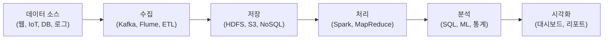

<Callout type="info">
  **이번 문서의 목표:** 빅데이터의 정의와 특성(5V), 데이터 유형 분류, 주요 수집 기술(Kafka, ETL, CDC 등), 빅데이터 플랫폼 아키텍처를 이해합니다.
</Callout>

## 빅데이터의 5V 특징

빅데이터는 단순히 "데이터가 많다"는 것을 넘어 5가지 특성으로 정의됩니다.

| V | 특성 | 설명 | 예시 |
|---|------|------|------|
| **Volume** | 대용량 | 기존 시스템으로 저장·처리 불가한 규모 | 일 수십 TB 이상 |
| **Velocity** | 고속 | 빠르게 생성되고 처리해야 함 | 초당 수만 건 로그, 실시간 센서 데이터 |
| **Variety** | 다양성 | 정형·반정형·비정형 등 다양한 형태 | 텍스트, 이미지, 동영상, JSON |
| **Veracity** | 정확성 | 데이터의 신뢰도와 품질 | 노이즈, 오류, 편향 여부 |
| **Value** | 가치 | 분석으로 비즈니스 가치 창출 | 수익 증가, 비용 절감, 의사결정 개선 |

<Callout type="info">
  초기에는 Volume, Velocity, Variety의 3V로 정의되었고, 이후 Veracity와 Value가 추가되어 5V가 되었습니다.
</Callout>

## 데이터 유형: 정형·반정형·비정형

| 유형 | 특징 | 저장 형태 | 예시 |
|------|------|----------|------|
| **정형**(Structured) | 행·열로 구성된 규칙적 구조 | 관계형 DB (테이블) | 고객 정보, 거래 내역, 주문 데이터 |
| **반정형**(Semi-structured) | 구조가 있지만 고정되지 않음 | JSON, XML, CSV, 로그 | API 응답 데이터, 웹 로그, 설정 파일 |
| **비정형**(Unstructured) | 구조가 없음 | 파일 시스템, NoSQL | 이메일 본문, 리뷰 텍스트, 이미지, 동영상 |

전통적인 RDB는 정형 데이터만 다루지만, 빅데이터 분석에서는 **비정형 데이터**가 전체의 80% 이상을 차지합니다.

## 데이터 수집 방식

빅데이터를 수집하는 방법은 데이터 소스와 요구 사항에 따라 다양합니다.

### 크롤링 / 웹 스크래핑

웹 페이지를 자동으로 방문하여 데이터를 추출합니다.

- **크롤링:** 하이퍼링크를 따라 다수 페이지를 탐색 (검색 엔진 방식)
- **스크래핑:** 특정 페이지에서 원하는 데이터 추출
- 주의: `robots.txt` 파일 확인 후 수집 허용 여부 반드시 준수

### Open API (REST API)

서비스 제공자가 공식적으로 제공하는 인터페이스를 통해 데이터를 요청·수신합니다.

- 예: 공공 데이터 포털 API, 날씨 API, 소셜미디어 API
- HTTP 요청 → JSON/XML 응답 형태

### 로그 수집: Flume, Logstash

서버·애플리케이션에서 발생하는 로그를 실시간으로 수집합니다.

- **Apache Flume:** 대용량 로그를 HDFS로 안정적으로 수집
- **Logstash:** ELK 스택(Elasticsearch-Logstash-Kibana)의 수집 컴포넌트

### 스트리밍 수집: Apache Kafka

실시간으로 생성되는 데이터를 지연 없이 전달하는 메시지 큐 시스템입니다.

```
데이터 생산자(Producer) → [Kafka 토픽] → 데이터 소비자(Consumer)
```

- 초당 수백만 건의 메시지 처리 가능
- 분산·내결함성 구조로 데이터 유실 방지
- 사용 사례: 클릭 스트림, 결제 이벤트, IoT 센서 데이터

### ETL: Extract-Transform-Load

배치(Batch) 방식으로 데이터를 정기적으로 수집·변환·적재합니다.

| 단계 | 내용 |
|------|------|
| **Extract **(추출) | 소스 시스템에서 데이터 추출 |
| **Transform **(변환) | 형식 통일, 결측치 처리, 비즈니스 규칙 적용 |
| **Load **(적재) | 목적지 시스템(DW, 데이터 레이크)에 저장 |

### CDC: Change Data Capture

데이터베이스에서 **변경된 데이터만** 실시간으로 캡처하여 전달합니다.

- 전체 데이터를 매번 복사하지 않아 효율적
- 방법: DB 트랜잭션 로그를 읽어 INSERT/UPDATE/DELETE 이벤트 감지

## 빅데이터 플랫폼 구성 흐름



## 람다 아키텍처(Lambda Architecture)

실시간 처리와 배치 처리를 동시에 지원하는 빅데이터 아키텍처입니다.

| 레이어 | 역할 | 기술 |
|--------|------|------|
| **배치 레이어**(Batch Layer) | 전체 데이터를 주기적으로 처리하여 정확한 뷰 생성 | Hadoop MapReduce, Spark |
| **스피드 레이어**(Speed Layer) | 최신 데이터를 실시간으로 처리하여 낮은 지연 보장 | Apache Kafka, Spark Streaming |
| **서빙 레이어**(Serving Layer) | 배치·스피드 결과를 합쳐 쿼리에 응답 | HBase, Cassandra, Druid |

장점: 배치의 정확성 + 스트리밍의 속도를 동시에 확보
단점: 두 레이어를 모두 유지·관리해야 하는 복잡성

## 카파 아키텍처(Kappa Architecture)

람다 아키텍처의 복잡성을 줄이기 위해 **스트리밍만으로** 배치와 실시간을 모두 처리하는 아키텍처입니다.

- 배치 레이어를 제거하고 스피드 레이어만 운영
- 재처리가 필요하면 스트리밍 파이프라인을 다시 돌림
- 장점: 단순한 구조, 중복 로직 제거
- 단점: 스트리밍 처리 기술의 성숙도 요구

| 구분 | 람다 아키텍처 | 카파 아키텍처 |
|------|--------------|--------------|
| **레이어** | 배치 + 스피드 + 서빙 | 스피드 + 서빙 |
| **복잡성** | 높음 | 낮음 |
| **재처리** | 배치로 처리 | 스트리밍 재실행 |
| **적합** | 정확도 중요, 레거시 환경 | 스트리밍 기술 성숙, 단순화 추구 |

## 핵심 정리

- 빅데이터 5V: **Volume(대용량), Velocity(고속), Variety(다양성), Veracity(정확성), Value**(가치)
- 데이터 유형: **정형(테이블), 반정형(JSON/XML), 비정형**(텍스트/이미지)
- 수집 방식: 크롤링, Open API, 로그 수집(Flume), 스트리밍(Kafka), ETL, CDC
- 람다 아키텍처: **배치 레이어 + 스피드 레이어 + 서빙 레이어**
- 카파 아키텍처: 스트리밍만으로 처리하여 람다 아키텍처를 단순화

## 마무리 복습

<Quiz
  questionNumber={1}
  question="빅데이터 5V 중 '데이터가 빠르게 생성되고 처리되어야 한다'는 특성을 나타내는 것은?"
  options={[
    'Volume (대용량)',
    'Variety (다양성)',
    'Velocity (고속)',
    'Veracity (정확성)'
  ]}
  correctAnswer={3}
  explanation="Velocity(고속)는 데이터가 생성·전송·처리되는 속도를 의미합니다. 실시간 클릭 로그, IoT 센서 데이터, 소셜미디어 게시글 등 초당 수만~수십만 건이 쏟아지는 데이터를 빠르게 처리해야 한다는 특성입니다."
  optionExplanations={[
    'Volume은 데이터의 규모(대용량)에 관한 특성입니다.',
    'Variety는 데이터 형태의 다양성(정형·반정형·비정형)에 관한 특성입니다.',
    '맞습니다. Velocity는 데이터 생성 및 처리 속도를 나타냅니다.',
    'Veracity는 데이터의 신뢰도와 품질(정확성)에 관한 특성입니다.'
  ]}
/>

<Quiz
  questionNumber={2}
  question="Apache Kafka에 대한 설명으로 옳은 것은?"
  options={[
    '배치 방식으로 전체 데이터를 주기적으로 적재하는 도구이다.',
    '데이터베이스의 변경된 내용만 실시간으로 캡처하는 기술이다.',
    '분산 메시지 큐 시스템으로 실시간 스트리밍 데이터 수집에 사용된다.',
    '웹 페이지를 자동으로 탐색하여 데이터를 수집하는 도구이다.'
  ]}
  correctAnswer={3}
  explanation="Apache Kafka는 분산 메시지 큐 시스템으로, 실시간으로 생성되는 대용량 스트리밍 데이터를 생산자(Producer)에서 소비자(Consumer)로 안정적으로 전달합니다. 초당 수백만 건의 메시지를 처리할 수 있으며, 클릭 스트림·결제 이벤트·IoT 데이터 수집에 널리 사용됩니다."
  optionExplanations={[
    '배치 방식 주기적 적재는 ETL(Extract-Transform-Load)의 특징입니다.',
    '데이터베이스 변경분만 캡처하는 것은 CDC(Change Data Capture)의 특징입니다.',
    '맞습니다. Kafka는 실시간 스트리밍 데이터 수집을 위한 분산 메시지 큐 시스템입니다.',
    '웹 페이지 자동 탐색은 크롤링/웹 스크래핑의 특징입니다.'
  ]}
/>

<Quiz
  questionNumber={3}
  question="람다 아키텍처(Lambda Architecture)의 3가지 레이어를 올바르게 나열한 것은?"
  options={[
    '수집 레이어, 처리 레이어, 서빙 레이어',
    '배치 레이어, 스피드 레이어, 서빙 레이어',
    '마스터 레이어, 스트리밍 레이어, 캐시 레이어',
    'ETL 레이어, 실시간 레이어, 분석 레이어'
  ]}
  correctAnswer={2}
  explanation="람다 아키텍처는 배치 레이어(전체 데이터 주기적 처리), 스피드 레이어(최신 데이터 실시간 처리), 서빙 레이어(배치+스피드 결과 합쳐 쿼리 응답) 세 가지로 구성됩니다. 배치의 정확성과 스트리밍의 빠른 응답 속도를 동시에 확보하는 것이 목적입니다."
  optionExplanations={[
    '수집·처리·서빙은 데이터 파이프라인의 일반적 단계이지 람다 아키텍처의 레이어가 아닙니다.',
    '맞습니다. 람다 아키텍처는 배치 레이어, 스피드 레이어, 서빙 레이어로 구성됩니다.',
    '마스터·스트리밍·캐시 레이어는 람다 아키텍처의 공식 용어가 아닙니다.',
    'ETL·실시간·분석 레이어는 람다 아키텍처의 공식 구성이 아닙니다.'
  ]}
/>

## 참고 자료

- [KDATA 데이터자격시험 - 빅데이터분석기사](https://www.dataq.or.kr/www/sub/a_07.do)
- [NIST/SEMATECH e-Handbook of Statistical Methods](https://www.itl.nist.gov/div898/handbook/)
