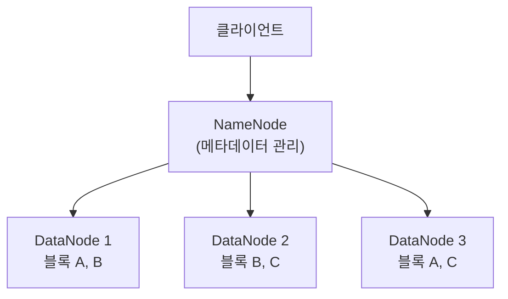

<Callout type="info">
  **이번 문서의 목표:** 대용량 데이터를 분산 저장·처리하는 핵심 기술인 HDFS, MapReduce, Apache Spark와 NoSQL 데이터베이스 4가지 유형을 이해합니다.
</Callout>

## HDFS: 분산 파일 시스템

**HDFS**(Hadoop Distributed File System) 는 대용량 파일을 여러 서버에 나누어 저장하는 분산 파일 시스템입니다.



### HDFS 구성 요소

| 구성 요소 | 역할 | 비유 |
|---|---|---|
| **NameNode** | 파일 메타데이터 관리 (어떤 블록이 어디 있는지) | 도서관 카탈로그 |
| **DataNode** | 실제 데이터 블록을 저장·처리 | 도서관 서가 |
| **Secondary NameNode** | NameNode 메타데이터 주기적 백업 (대체 아님) | 카탈로그 복사본 |

### HDFS 주요 특징

- **블록 크기:** 기본 128MB (큰 파일을 블록으로 나누어 저장)
- **복제 계수(Replication Factor):** 기본 3 (같은 블록을 3개 서버에 복사 → 장애 내성)
- **단일 장애점(SPOF) 문제:** NameNode가 하나이므로 NameNode 장애 시 전체 중단 → HA(High Availability) 구성으로 해결

<Callout type="warning">
  **시험 포인트:** 블록 기본 크기는 128MB, 복제 계수 기본은 3입니다. NameNode는 SPOF(단일 장애점)라는 것도 중요합니다.
</Callout>

## MapReduce: 분산 병렬 처리

**MapReduce** 는 대용량 데이터를 여러 서버에서 동시에 처리하는 분산 병렬 처리 모델입니다. 크게 3단계로 구성됩니다.

| 단계 | 내용 |
|------|------|
| **Map** | 입력 데이터를 (key, value) 쌍으로 변환 |
| **Shuffle & Sort** | 동일 key끼리 그룹화하고 정렬 |
| **Reduce** | 같은 key의 value들을 집계·요약 |

### 단어 수 세기 예시 (Word Count)

```
입력 데이터:
"hello world hello hadoop world"

Map 단계:
(hello, 1), (world, 1), (hello, 1), (hadoop, 1), (world, 1)

Shuffle & Sort:
(hadoop, [1])
(hello, [1, 1])
(world, [1, 1])

Reduce 단계:
(hadoop, 1)
(hello, 2)
(world, 2)
```

MapReduce의 한계: **디스크 기반 처리** → 각 단계마다 HDFS에 쓰고 읽어서 느림 → Apache Spark로 대체 추세

## NoSQL 데이터베이스 4유형

관계형 데이터베이스(RDBMS)의 한계를 극복하기 위해 등장한 **NoSQL**(Not Only SQL) 은 4가지 유형으로 분류됩니다.

| 유형 | 대표 제품 | 저장 구조 | 특징 | 사용 사례 |
|------|----------|----------|------|----------|
| **Key-Value** | Redis, DynamoDB | 키-값 쌍 | 단순, 초고속 읽기/쓰기 | 캐시, 세션 관리, 장바구니 |
| **Document** | MongoDB, Couchbase | JSON/BSON 문서 | 유연한 스키마, 중첩 구조 | 상품 카탈로그, 사용자 프로필 |
| **Column-Family** | HBase, Cassandra | 컬럼 패밀리 | 대용량 쓰기, 수평 확장 | 시계열 데이터, 로그, IoT |
| **Graph** | Neo4j, Amazon Neptune | 노드-엣지 그래프 | 관계 탐색 최적화 | SNS 친구 관계, 추천 시스템 |

### NoSQL vs RDBMS 비교

| 구분 | RDBMS | NoSQL |
|------|-------|-------|
| **스키마** | 고정 스키마 | 유연한 스키마 |
| **확장 방식** | 수직 확장 (서버 업그레이드) | 수평 확장 (서버 추가) |
| **일관성** | ACID 보장 | BASE 모델 (Eventually Consistent) |
| **쿼리** | SQL | 제품별 고유 API |
| **적합** | 복잡한 트랜잭션, 정규화 데이터 | 대용량, 높은 쓰기 처리량, 비정형 |

## Apache Spark: 인메모리 분산 처리

**Apache Spark** 는 메모리(RAM)를 활용한 인메모리 분산 처리 프레임워크입니다.

- MapReduce 대비 **최대 100배** 빠른 처리 속도 (메모리 처리)
- 배치·스트리밍·머신러닝·그래프 처리를 하나의 플랫폼에서 지원

### RDD(Resilient Distributed Dataset)

Spark의 핵심 데이터 추상화 개념입니다.

| 특성 | 설명 |
|------|------|
| **Resilient **(탄력성) | 장애 발생 시 자동으로 재계산하여 복구 |
| **Distributed **(분산) | 여러 노드에 나뉘어 저장됨 |
| **Dataset **(데이터셋) | 불변(Immutable)한 데이터 컬렉션 |

### Spark 생태계

| 컴포넌트 | 역할 |
|---|---|
| **Spark SQL** | 구조적 데이터를 SQL로 처리 |
| **MLlib** | 분산 환경의 머신러닝 라이브러리 |
| **Spark Streaming** | 실시간 스트리밍 데이터 처리 |
| **GraphX** | 그래프 데이터 처리 |

## 데이터 웨어하우스 vs 데이터 레이크

| 구분 | 데이터 웨어하우스 (DW) | 데이터 레이크 |
|------|----------------------|--------------|
| **데이터 형태** | 정형 데이터만 | 정형·반정형·비정형 모두 |
| **스키마** | 저장 전 스키마 정의 (Schema-on-Write) | 저장 후 읽을 때 스키마 정의 (Schema-on-Read) |
| **처리** | 사전 집계·변환 완료 | 원시 데이터 그대로 저장 |
| **사용자** | BI 분석가, 비즈니스 사용자 | 데이터 과학자, 엔지니어 |
| **성능** | 쿼리 성능 최적화 | 유연성 우선 |
| **대표 기술** | Amazon Redshift, Snowflake | Amazon S3, Azure Data Lake |

<Callout type="info">
  최근에는 데이터 웨어하우스와 데이터 레이크의 장점을 결합한 **데이터 레이크하우스**(Data Lakehouse) 가 주목받고 있습니다. 대표 기술: Delta Lake, Apache Iceberg
</Callout>

## 핵심 정리

- HDFS: **NameNode(메타데이터) + DataNode**(블록 저장), 블록 128MB, 복제 계수 3
- NameNode는 **SPOF**(단일 장애점) → HA 구성으로 해결
- MapReduce: **Map(key-value 변환) → Shuffle&Sort(key 기준 정렬) → Reduce**(집계)
- NoSQL 4유형: **Key-Value(Redis), Document(MongoDB), Column-Family(HBase), Graph**(Neo4j)
- Apache Spark: 인메모리 처리, MapReduce 대비 최대 100배 빠름
- RDD: **Resilient(탄력성) + Distributed(분산) + Dataset**(불변 데이터)
- 데이터 웨어하우스: 정형·사전 정의 스키마 / 데이터 레이크: 모든 형태·원시 데이터

## 마무리 복습

<Quiz
  questionNumber={1}
  question="HDFS에서 NameNode의 역할과 SPOF(단일 장애점) 문제에 대한 설명으로 옳은 것은?"
  options={[
    'NameNode는 실제 데이터 블록을 저장하며, 장애 시 DataNode가 자동으로 역할을 대체한다.',
    'NameNode는 파일 메타데이터를 관리하며, NameNode 장애 시 전체 시스템이 중단되는 SPOF 문제가 있다.',
    'NameNode는 데이터를 복제하는 역할을 하며, 기본 복제 계수는 5이다.',
    'NameNode는 여러 대 운영되어 SPOF 문제가 없다.'
  ]}
  correctAnswer={2}
  explanation="NameNode는 파일 메타데이터(어떤 블록이 어느 DataNode에 있는지)를 관리하는 마스터 노드입니다. HDFS 기본 구성에서 NameNode는 단 하나이므로, NameNode 장애 시 전체 시스템이 중단됩니다. 이를 SPOF(Single Point of Failure, 단일 장애점)라 하며, Active-Standby HA 구성으로 해결합니다."
  optionExplanations={[
    '실제 데이터 블록을 저장하는 것은 DataNode의 역할입니다.',
    '맞습니다. NameNode는 메타데이터 관리, SPOF 문제가 있으며 HA 구성으로 해결합니다.',
    '데이터를 복제하는 주체는 DataNode이며, 기본 복제 계수는 3입니다.',
    '기본 HDFS 구성에서 NameNode는 단 하나로 운영되어 SPOF 문제가 발생합니다.'
  ]}
/>

<Quiz
  questionNumber={2}
  question="NoSQL 데이터베이스의 유형 중 'Redis'가 해당하는 유형과 주로 사용되는 사례는?"
  options={[
    'Document 유형, 상품 카탈로그 저장에 사용',
    'Column-Family 유형, 대용량 시계열 데이터 저장에 사용',
    'Key-Value 유형, 캐시·세션 관리에 사용',
    'Graph 유형, SNS 친구 관계 저장에 사용'
  ]}
  correctAnswer={3}
  explanation="Redis는 Key-Value 유형의 NoSQL 데이터베이스입니다. 키와 값의 단순한 쌍으로 데이터를 저장하며, 메모리 기반으로 초고속 읽기/쓰기가 가능합니다. 웹 세션 관리, 캐시, 실시간 순위표 등에 주로 사용됩니다."
  optionExplanations={[
    'Document 유형의 대표 제품은 MongoDB입니다. Redis는 Key-Value입니다.',
    'Column-Family 유형의 대표 제품은 HBase, Cassandra입니다.',
    '맞습니다. Redis는 Key-Value 유형으로 캐시와 세션 관리에 주로 사용됩니다.',
    'Graph 유형의 대표 제품은 Neo4j입니다.'
  ]}
/>

<Quiz
  questionNumber={3}
  question="데이터 웨어하우스와 데이터 레이크의 차이에 대한 설명으로 옳은 것은?"
  options={[
    '데이터 레이크는 정형 데이터만 저장하며, 스키마가 사전에 정의되어 있다.',
    '데이터 웨어하우스는 Schema-on-Read 방식으로 읽을 때 스키마를 정의한다.',
    '데이터 레이크는 정형·반정형·비정형 모두 저장하며, Schema-on-Read 방식을 사용한다.',
    '데이터 웨어하우스와 데이터 레이크는 동일한 사용자 그룹을 대상으로 한다.'
  ]}
  correctAnswer={3}
  explanation="데이터 레이크는 정형·반정형·비정형 데이터를 원시(Raw) 형태로 저장하며, 저장 후 읽을 때 스키마를 정의하는 Schema-on-Read 방식을 사용합니다. 반면 데이터 웨어하우스는 정형 데이터만, 저장 전에 스키마를 정의하는 Schema-on-Write 방식입니다."
  optionExplanations={[
    '정형 데이터만 저장하고 사전 스키마를 정의하는 것은 데이터 웨어하우스의 특징입니다.',
    'Schema-on-Read(읽을 때 스키마 정의)는 데이터 레이크의 특징입니다. 데이터 웨어하우스는 Schema-on-Write입니다.',
    '맞습니다. 데이터 레이크는 모든 형태의 데이터를 원시 상태로 저장하며 Schema-on-Read 방식입니다.',
    '데이터 웨어하우스는 BI 분석가·비즈니스 사용자, 데이터 레이크는 데이터 과학자·엔지니어가 주 사용자입니다.'
  ]}
/>

## 참고 자료

- [KDATA 데이터자격시험 - 빅데이터분석기사](https://www.dataq.or.kr/www/sub/a_07.do)
- [NIST/SEMATECH e-Handbook of Statistical Methods](https://www.itl.nist.gov/div898/handbook/)
